# Prepare Environment with Codespace on GitHub

go to the https://github.com (logined)

1. [Create a new repository](https://docs.github.com/en/repositories/creating-and-managing-repositories/creating-a-new-repository) named "Workspace".

2. On the top side you can see <b>Codespaces</b>

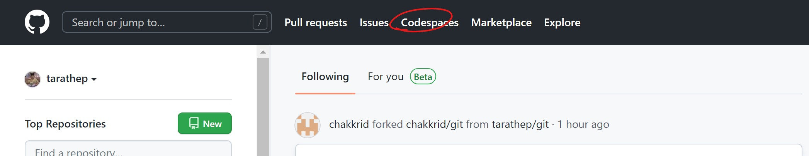

3. Click New codespace

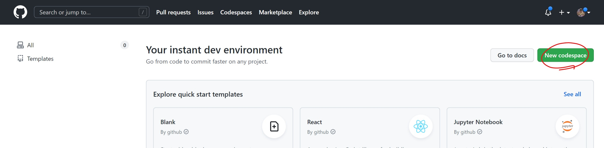

4. Choose 
    - Your Repository named `<username>/workspace`
    - Branch : main
    - Region : Default
    - Machine type : 2-core
and then `Create codespace`

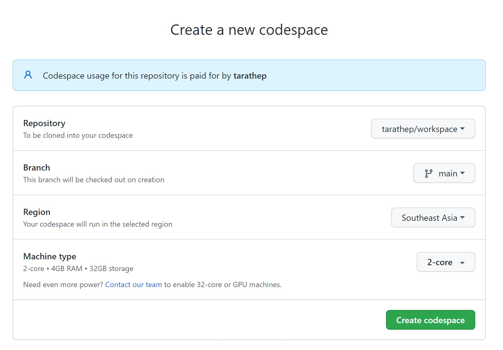

5. You can see Visual Studio Code.

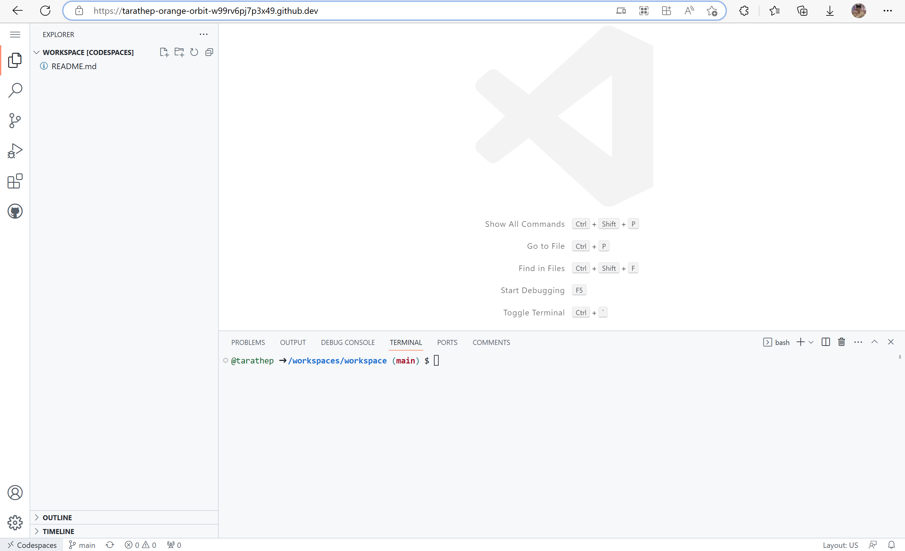

## Setting up a C# (.NET) project for GitHub Codespaces

1. Prepare Dotnet and Azure CLI press `Ctrl` + `Shift` + `P`, then start typing <b>"dev container"</b>. Click `Codespaces: Configure Dev Container`.

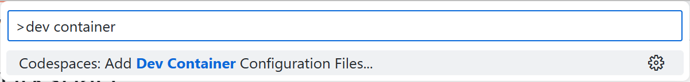

2. Click `Create a new configuration..`

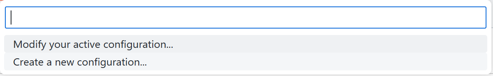

3. Click Show All Definitions.

4. Type c# and click C# (.NET)

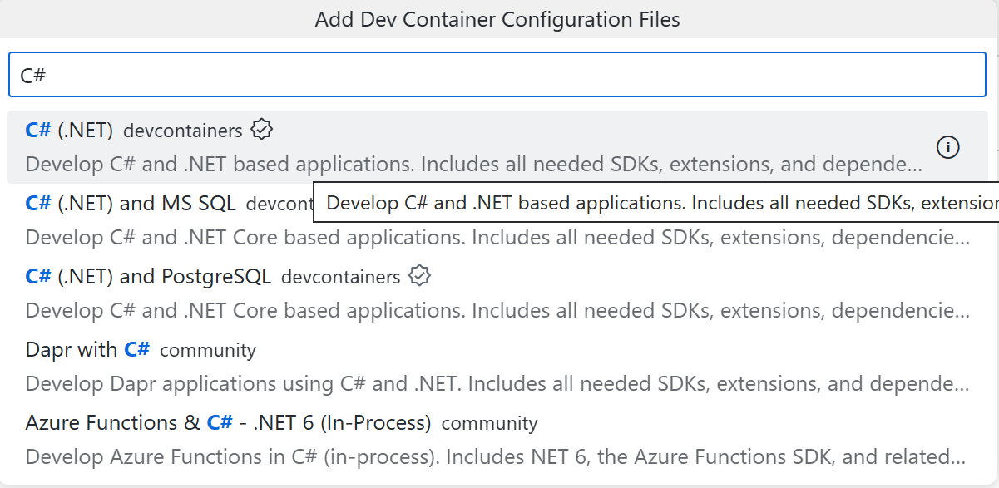

5. Choose the version of .NET you want to use for your project. In this case, select the version marked "6.0"

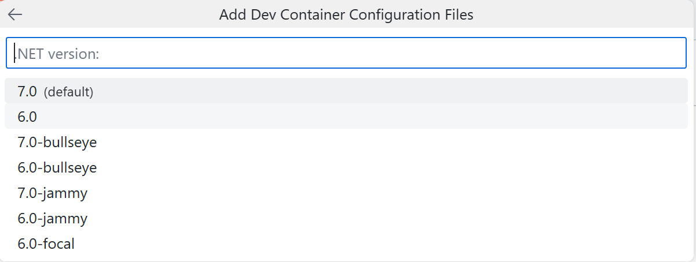

6. A list of additional features is displayed. We'll install the .NET CLI, a command-line interface for developing, building, running, and publishing .NET applications. To install this tool, type dotnet, select Dotnet CLI and Azure CLI then click OK.

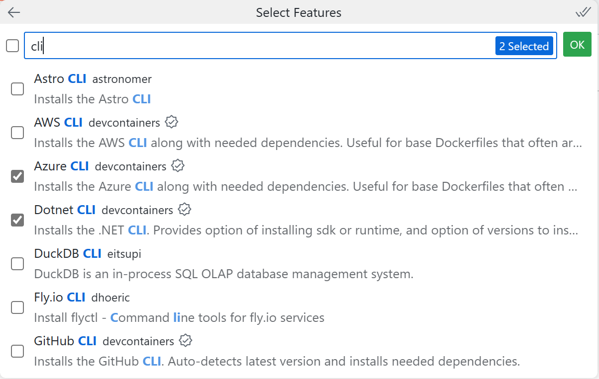

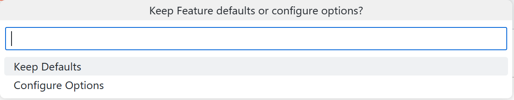

A message is displayed telling you that the dev container configuration file already exists. Click Overwrite.

7. A devcontainer.json file is created and is opened in the editor.

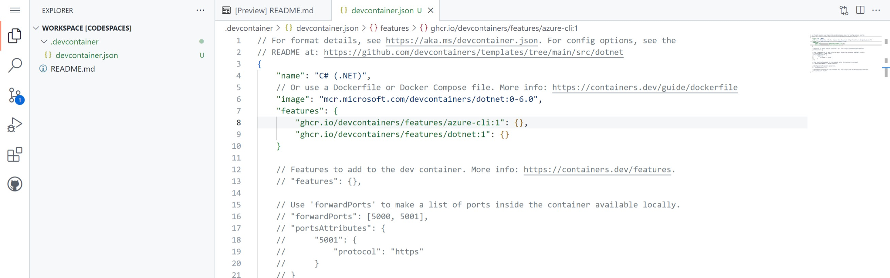

8. Access the VS Code Command Palette `(Shift+Command+P / Ctrl+Shift+P)`, then start typing <b>"rebuild"</b>. Click `Codespaces: Rebuild Container.

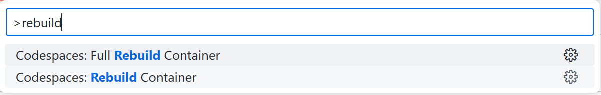

9. Rebuild

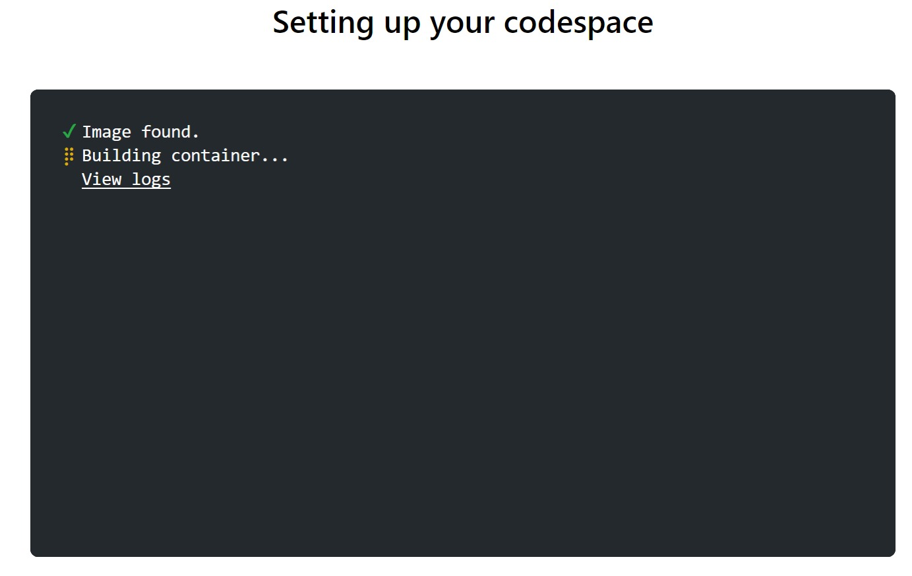

Done.

Ref. : https://docs.github.com/en/codespaces/setting-up-your-project-for-codespaces/adding-a-dev-container-configuration/setting-up-your-dotnet-project-for-codespaces#step-2-add-a-dev-container-configuration

