# LAB 1 : Initialization Application

<div align="center">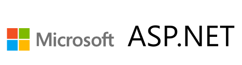</div>

Learn how application working and implementation concepts.
- After completing this lab, you'll be able to:
- Describe or explain how to design and implement application. 
- Explain debug and run project that implement with Dotnet 6 and C# (ASP.NET Web application).
- Describe or explain how to use API (Application Programming Interface) via Restful API protocol HTTP by Command CRUD (Create, Read, Update and Delete).
- Describe or explain how to implementation of Unit Test and Mock Test to test business services and APIs.

In this lab we use sample application that is named <b>Tutorial API Backend</b> and <b>Tutorial Frontend</b> we focus on Backend application.

<div align="center">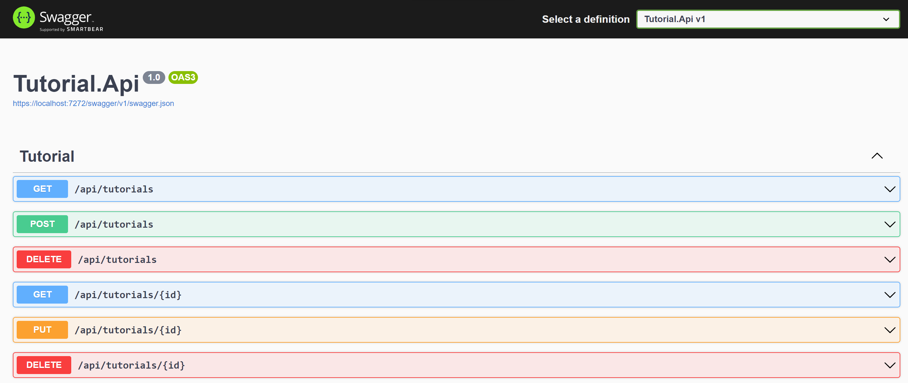</div>


## Prerequisites

- <b>Workspace that required Software and Tools</b> 
    - Dotnet 6 you can download at official site: Download .NET 6.0 (Linux, macOS, and Windows) (microsoft.com) focus on SDK
    - Git and GitHub Account
    - Text Editor (Required Visual Studio Code, or Visual Studio) Visual Studio Code - Code Editing. Redefined
    - AZ CLI (How to install the Azure CLI | Microsoft Learn)
- <b>Infrastructures or Resources on Azure</b>
    - Azure App service (Webapp support deploy code and dotnet6) 
    - Azure App service plan (Windows or Linux)
    - Azure Cosmos DB for MongoDB API (Step for Initialize cosmos DB)
    - Azure Key Vault (if any)
    - Azure Application Insights (if any)


## 1. Reviewing source code and Inspect

download source code program from GitHub with git command: 

```bash
git clone https://github.com/tarathep/dotnet-tutorial-backend.git
```

when downloaded success open this project with text editor (Visual Studio Code)

Walkthrough and describe project on Structure project inside directory (dotnet-tutorial-backend)

you can open with command to open with Visual Studio Code by following command below

```bash
cd dotnet-tutorial-backend
code .
```

<div align="center">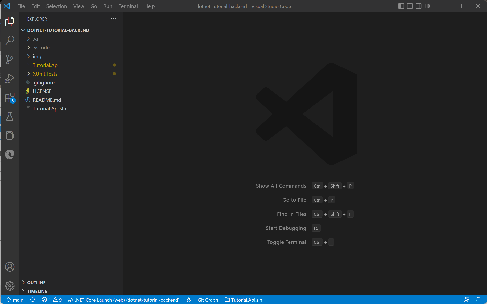</div>

Or you can alternative solution to open.

you can see this inside we are focusing 2 projects

- <b>Tutorial.Api.sln</b> is control solution file that contain 2 projects and specific to support Dotnet project in dotnet SDK on Visual Studio and Visual Studio Code.

- <b>Tutorial.Api</b> is APIs application for runtime and business.

- <b>XUnit.Tests</b> is Unit Tests by test Tutorial.Api focus on Business logics inside service and controller.

## 2. Prepare to configuration application

In Application Tutorial.Api  you can see file app.<i>settings.json</i>

before try to run you must set values in bellows

- TutorialDatabase
    - <b>ConnetionString</b> : `“enter the value by copy connection from azure portal “ `
    - <b>DatabaseName</b> : `”enter the value named dev-tutorial”`

<div align="center">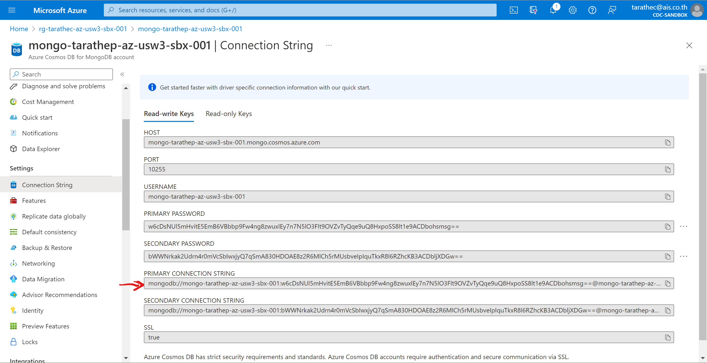</div>

ApplicationInsights (Optional)
- ConnectionString : `“copy connection string from“`

```json
{
  "TutorialDatabase": {
    "ConnectionString": "",
    "DatabaseName": "",
    "TutorialCollectionName": "tutorials"
  },
  "Logging": {
    "ApplicationInsights": {
      "LogLevel":{
        "Default": "Debug",
        "Microsoft": "Error"
      }
    },
    "LogLevel": {
      "Default": "Trace",
      "Microsoft.AspNetCore": "Warning"
    }
  },
  "AllowedHosts": "*",
  "ApplicationInsights": {
    "ConnectionString": ""
  }
}
```

## 3. First to use and running Application on Local

please checking system you’re ready.

Check dotnet SDK 6 on your workspace

```bash
dotnet --version
```

Restore dependencies and projects

```bash
dotnet clean
dotnet restore
```

And then try to run on localhost

```bash
cd Tutorial.Api
dotnet run
```

<p style="color:red;"><i>PS. please check database CosmosDB that named mongo-{name}-az-<region>-sbx-001 to allow access public internet. (Specific IP address)</i></p>

<div align="center">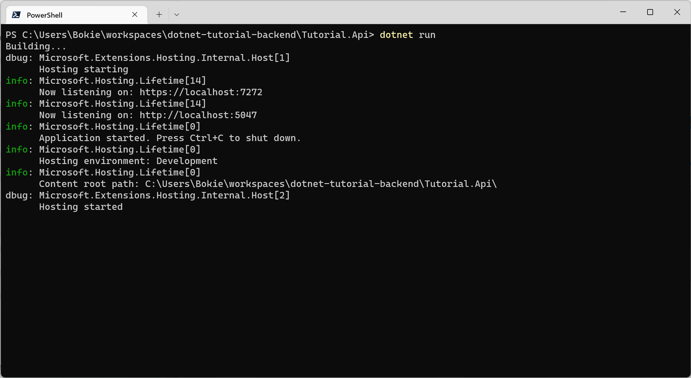</div>

Test Application by Open the browser (Google Chrome or Edge or others) go to

https://localhost:{port}/swagger

<div align="center">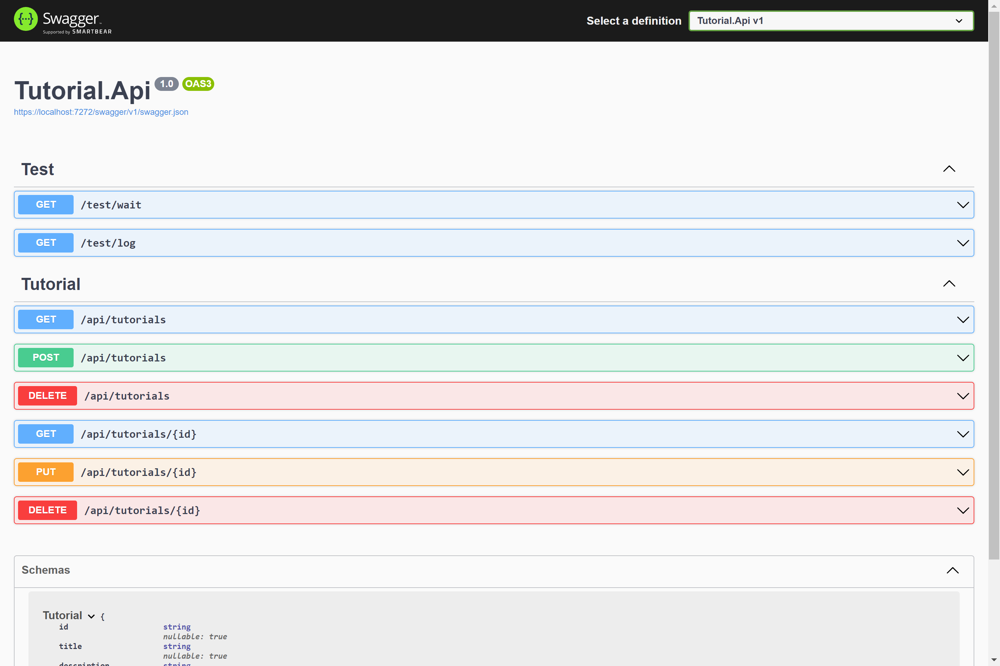</div>

and trying to Get

https://localhost:{port}/api/tutorials

If everything is work, you can see.

<div align="center">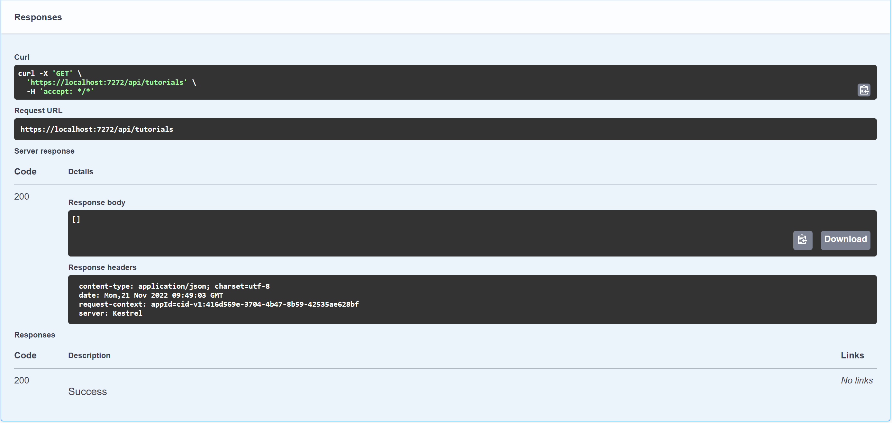</div>


## 4. Unit Tests

Focus on  XUnit.Tests project to review code in unittest.

In this unit test case, we focus on file `TutorialControllerTests.cs` to test APIs Controller in Tutorial.Api.

for simple unit test you can see on this `PrimeServiceTests.cs` that easy to understand.

<div align="center">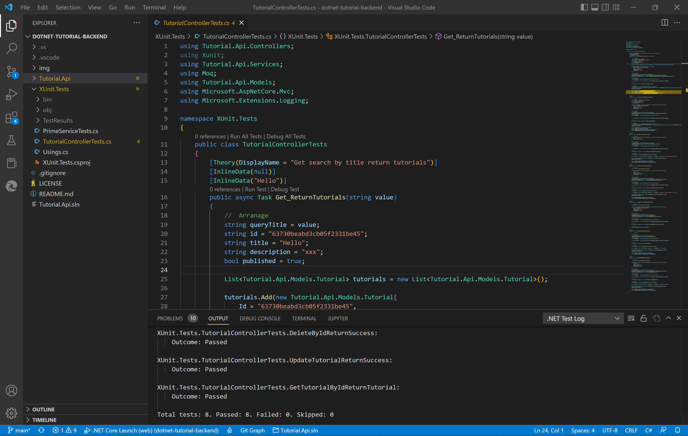</div>

that can run basic command to execute unit tests in below.

```bash
dotnet test
```
 
If you want to record code coverages, please following this command in below.

```bash
dotnet test --collect:"XPlat Code Coverage"
```
<div align="center">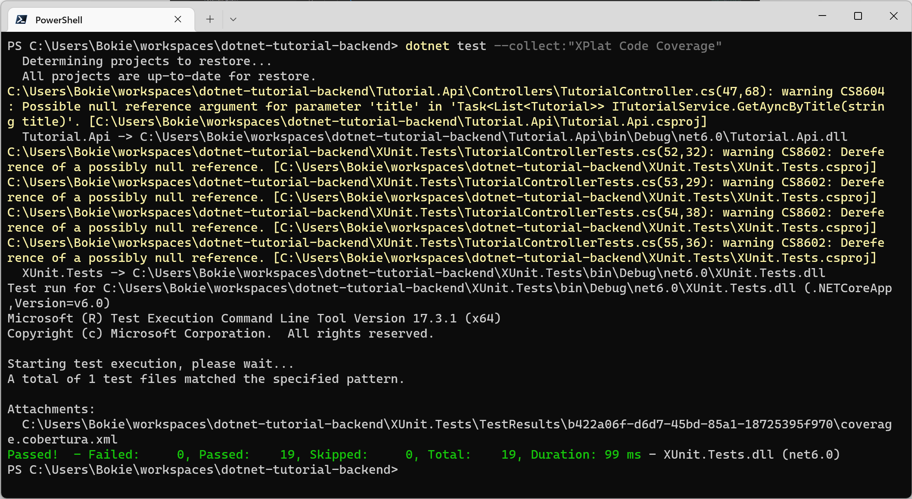</div>

You can see output to new directory named TestResults that contain files <i style="color:red">coverage.cobertura.xml</i>

<div align="center">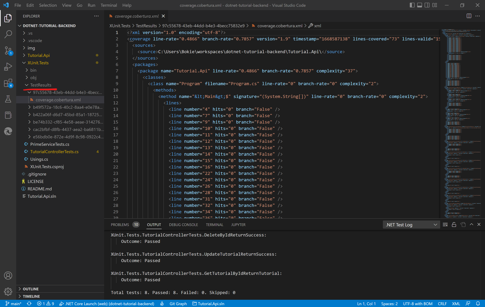</div>

## 5. Report Unit Tests and Review Code coverage

you can use tools dotnet for convert code coverage from coverage.cobertura.xml to HTML reports that easy to reviews. ([ReportGenerator](https://reportgenerator.io/))

<div align="center"></div>

First steps install tool via dotnet with command

```bash
dotnet add package ReportGenerator --version 5.1.10
```

Setup tool ReportGenerator

```bash
dotnet tool install -g dotnet-reportgenerator-globaltool
```

more: https://www.nuget.org/packages/ReportGenerator

Run HTML Report

```bash
reportgenerator -reports:"XUnit.Tests\TestResults\*\coverage.cobertura.xml" -targetdir:"./coveragereport" -reporttypes:Html
```

<div align="center">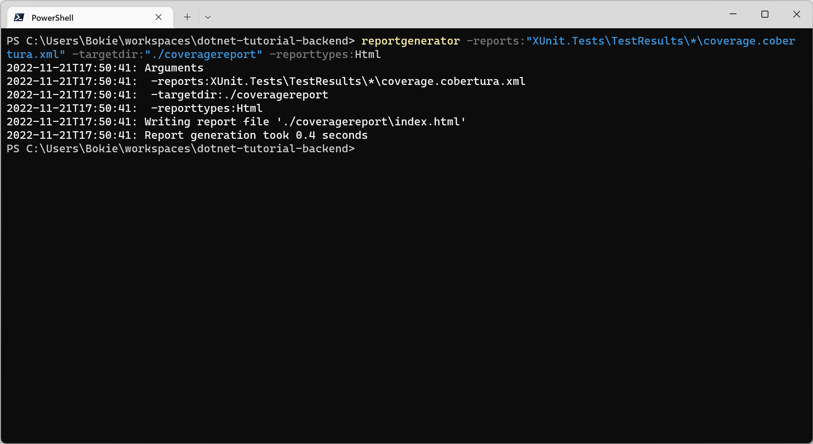</div>

you can see new directory named <i>coveragereport</i>  and then open <i>index.html</i> inside.

<div align="center">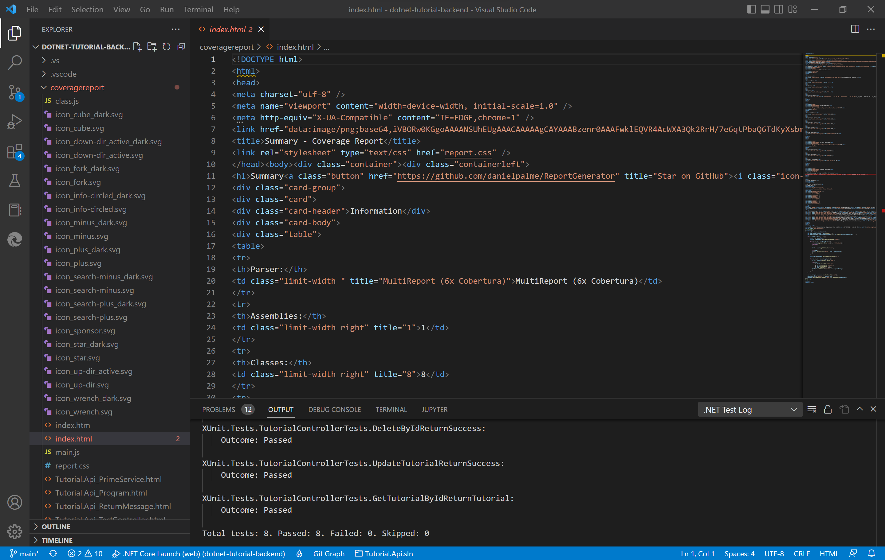</div>

Summary Report

<div align="center">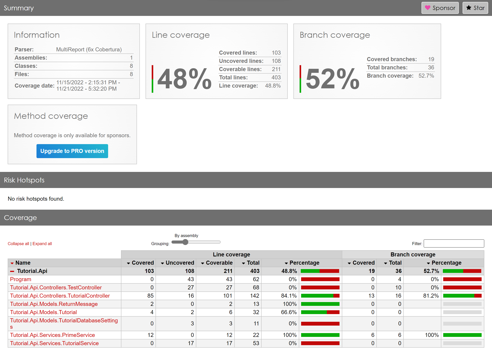</div>

Done :D .