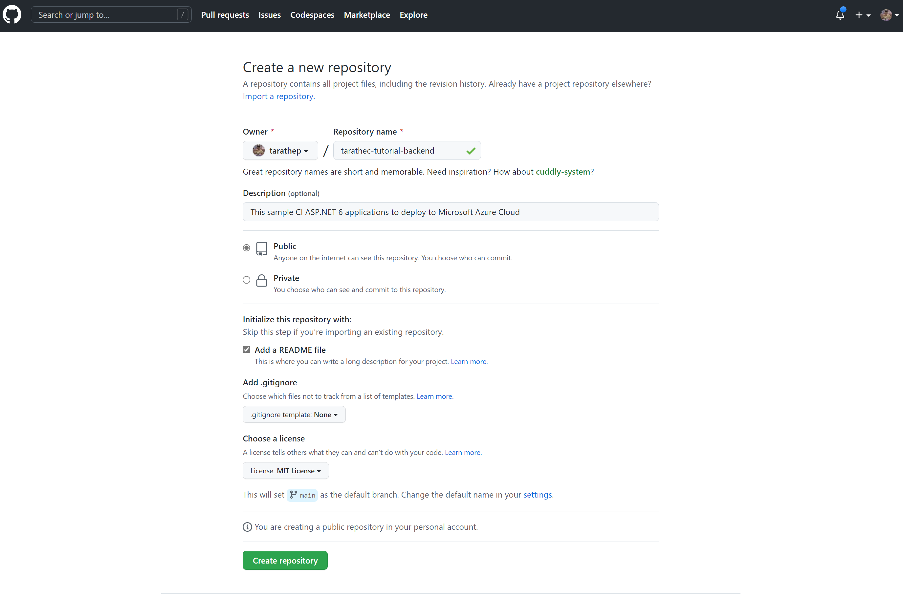
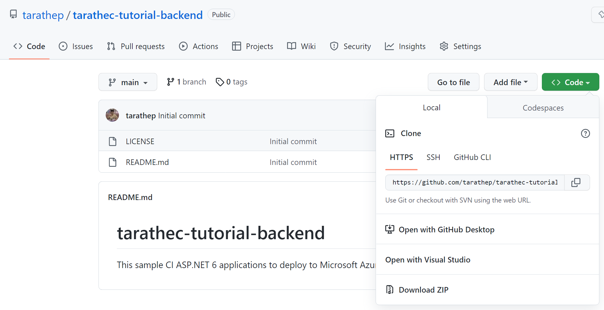
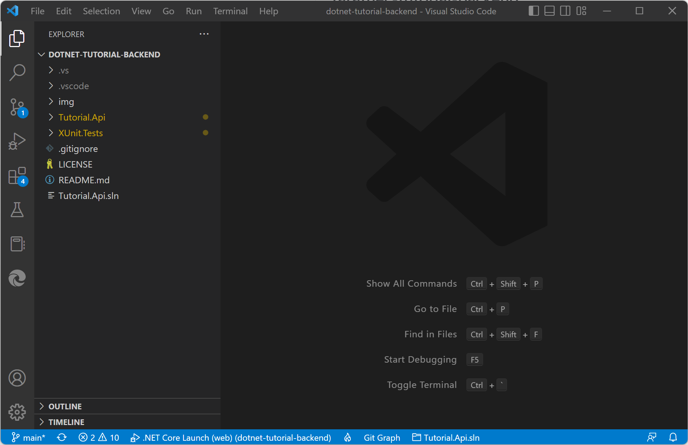
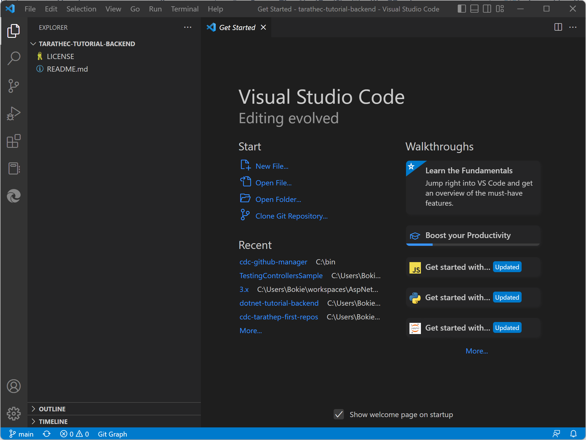
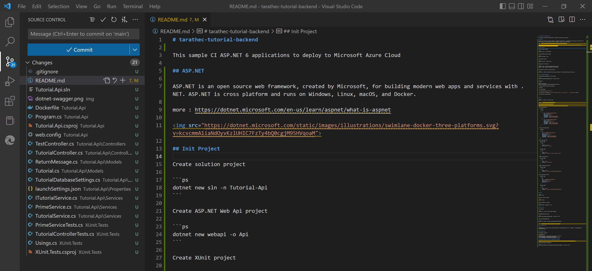
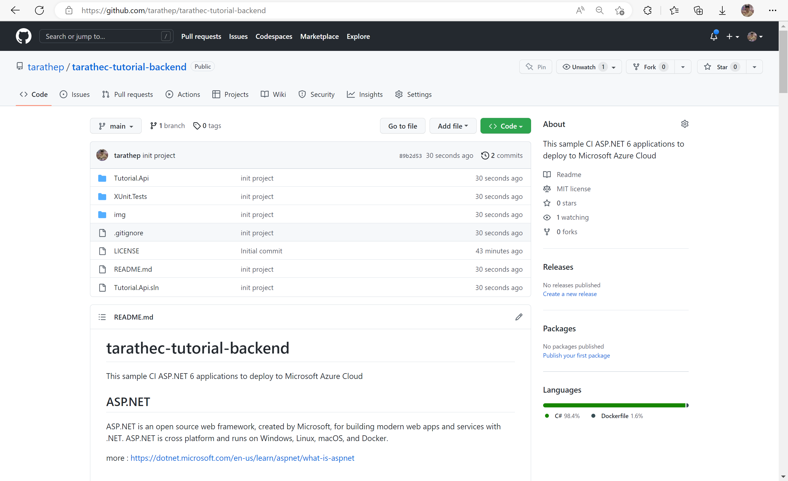

# LAB 2 : Migrate Application to your Git Repository

Learn how to migrate application to your git repository

After completing this lab, you'll be able to:
- Have an application on your GitHub repository.
- Create Continuous Integration repository.
- Copy application from another repository to target repository

## Prerequisites

- <b>Workspace that required Software and Tools</b> 
    - Git and GitHub Account
    - Text Editor (Required Visual Studio Code, or Visual Studio) Visual Studio Code - Code Editing. Redefined

## 1. Create repository on GitHub

go to <b>github.com/{username}</b>

Select new repository on the top right-hand side.
- Owner: `{username}`
- Repository name: `{username or name}`-tutorial-backend`
- Description: `Optional`
- Public
- Initialize this repository with
    - Add a README file.
    - Choose a license: MIT License
- use on branch main to default branch.

<div align="center"></div>

## 2. Working repository on local

In this repository page you can see `<>Code` button, copy the URL to check out.

<div align="center"></div>


Open the Terminal to use this command to clone source repository from `github.com/tarathep/dotnet-tutorial-backend` into your `local workspace`.

```bash
git clone https://github.com/tarathep/dotnet-tutorial-backend.git
```

```bash
cd dotnet-tutorial-backend
code .
```

And open this project with Visual Studio Code.

<div align="center"></div>

Open another window Terminal and use this command to clone empty your repository.

```bash
git clone https://github.com/{username}/{username}-tutorial-backend.git
```

```bash
cd {username}-tutorial-backend.git
```

And open this project with Visual Studio Code

<div align="center"></div>

Copy all source codes and files from `dotnet-tutorial-backend` to `{username}-tutorial-backend` (Overwrite)

and push to your GitHub repository.

```bash
git add .
```

```bash
git commit -m "init project"
```

```bash
git push
```

Alternative, you can use Visual Studio Code Git

<div align="center"></div>

when finished, you will see this.

<div align="center"></div>

Done :D

