# LAB 3 : Build Artifact and Deploy to Azure App Service (Web App)

<div align="center"></div>

Learn how to build dotnet application output to artifact and deploy to Azure App service (Web app)

After completing this lab, you'll be able to:
- Explain how to build Dotnet project application.
- Explain how to deploy application to Azure with CLI (AZ Command).

## Prerequisites

- <b>Workspace that required Software and Tools</b> 
    - Dotnet 6 you can download at official site: [Download .NET 6.0 (Linux, macOS, and Windows) (microsoft.com)](https://dotnet.microsoft.com/en-us/download/dotnet/6.0) focus on SDK
    - Git and GitHub Account
    - Text Editor (Required Visual Studio Code, or Visual Studio) [Visual Studio Code - Code Editing. Redefined](https://code.visualstudio.com/)
    - AZ CLI ([How to install the Azure CLI | Microsoft Learn](https://learn.microsoft.com/en-us/cli/azure/install-azure-cli))
- <b>Infrastructures or Resources on Azure</b>
    - Azure App service (Webapp support deploy code and dotnet6) 
    - Azure App service plan (Windows or Linux)
    - Azure Cosmos DB for MongoDB API (Step for Initialize cosmos DB)
    - Azure Key Vault (if any)
    - Azure Application Insights (if any)
- Requred lab2

## Build Artifact

On the lab2, you have already to source code project on workspaces, or you can check out from your GitHub repository.

```bash
git clone https://github.com/<username>/<username>-tutorial-backend.git
```

Open this project with Visual Studio Code.

<div align="center">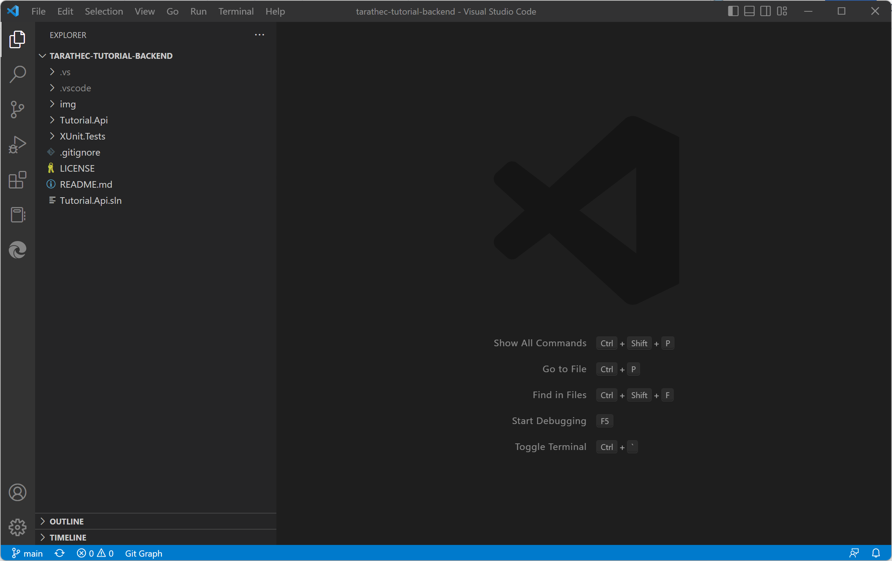</div>

Open the Terminal to build project with dotnet command

Check dotnet SDK version

```bash
dotnet --version
```

If you have multiple versions you can list sdk with command

```bash
dotnet --list-sdks
```

Switch default version

```bash
dotnet new globaljson
```

and change version into `global.json` in root path

```json
{
  "sdk": {
    "version": "6.0.x.x"
  }
}
```


Focusing on project <b>Tutorial.Api</b> by make sure currently directory and run following command

Clean package and cached

```bash
dotnet clean
```

Restore dependencies into project

```bash
dotnet restore
```

Build artifact that output to bin directory (binary file)

```bash
dotnet build
```

<div align="center">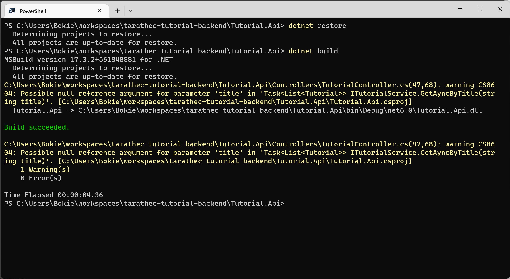</div>

Build and publish a release to output

```bash
dotnet publish -c Release -o out
```

<div align="center">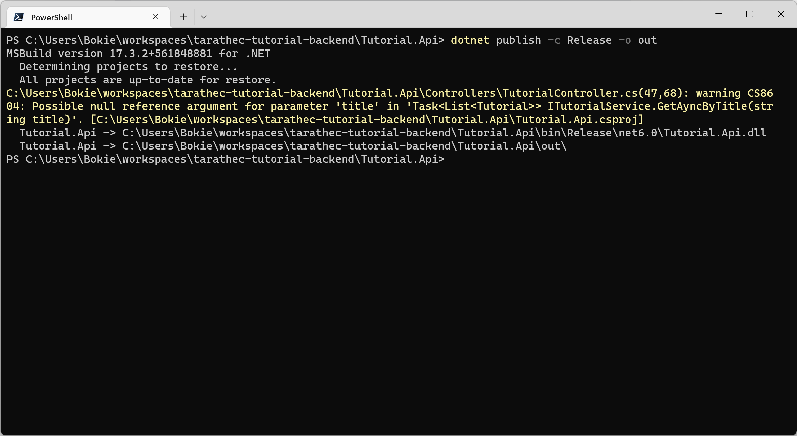</div>

you can see in this project files, the output artifact into `bin\Release\net6.0\Tutorial.Api.dll` and output to deploy out to `out`

<div align="center">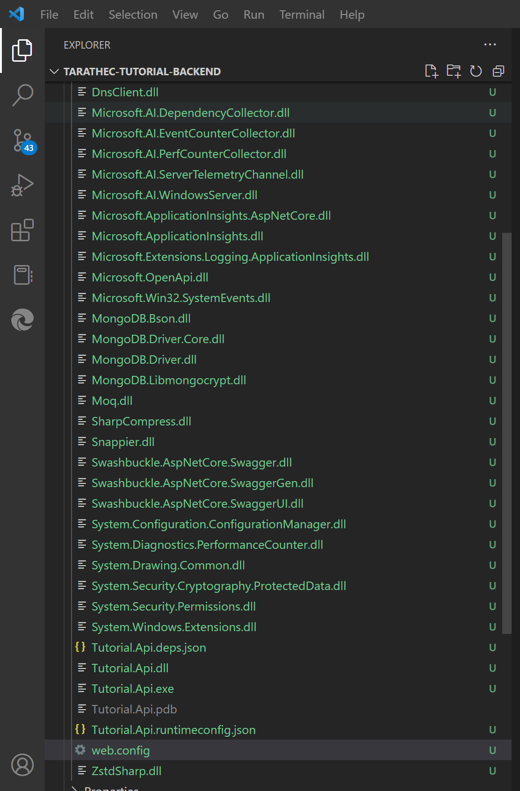</div>


Endpoint to execute or run at `Tutorial.Api.dll `or `Tutorial.Api.exe` and Configurations in `web.config` and `appsettings.json`

Run Application with Artifact with this command

```bash
dotnet ./Tutorial.Api.dll
```

<i style="color:red">P.S. before running, please check appsettings.json to configuration when you try to call APIs may be found error in this console.</i>

<div align="center">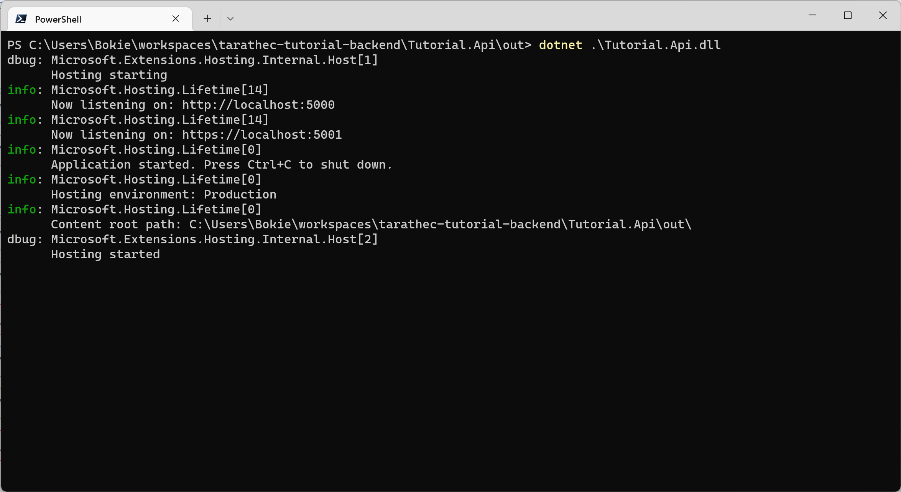</div>

<div align="center">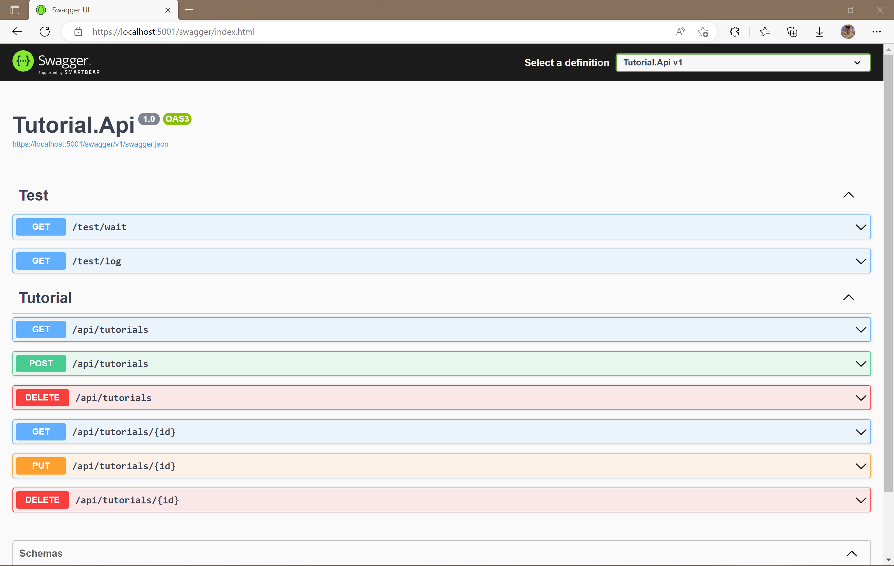</div>

## Deploy with AZ command to App service (Web app)
 
On Azure portal Microsoft Azure check resource to deploy to `app-<username>-az-<region>-dev-001` at subscription named `sub-POC-CDC-az-sb` in resource group named `rg-<username>-az-<region>-sbx-001.`

<div align="center">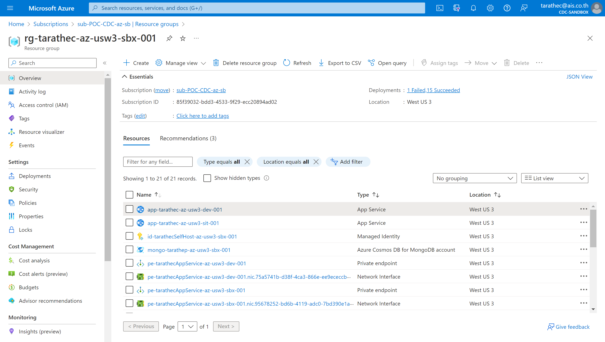</div>

Click on `app-<username>-az-<region>-dev-001` and try to access via public internet with URL `https://app-<username>-az-<region>-dev-001.azurewebsites.net`

<div align="center">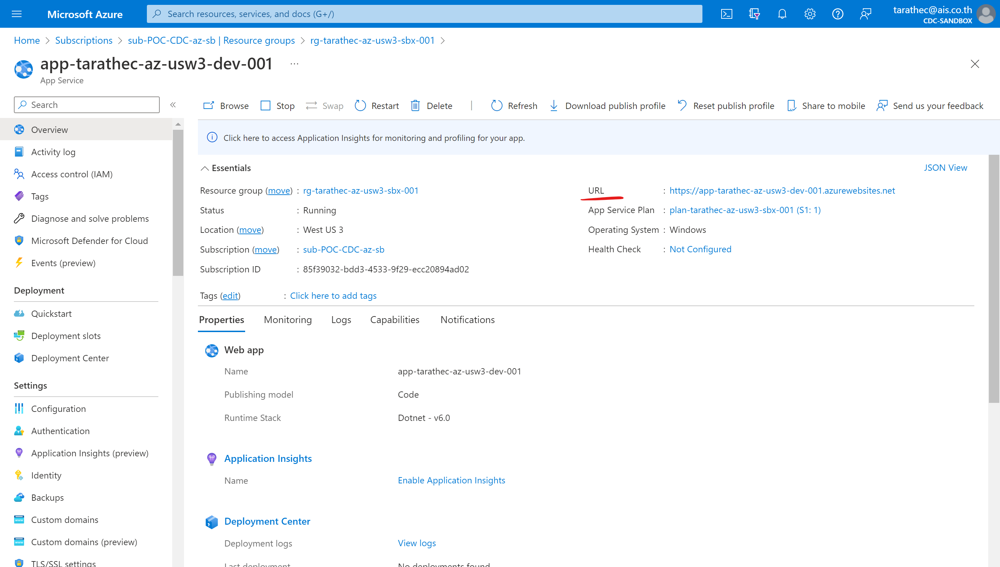</div>

Test accessing on public internet with domain `app-<username>-az-<region>-dev-001.azurewebsites.net`

<div align="center">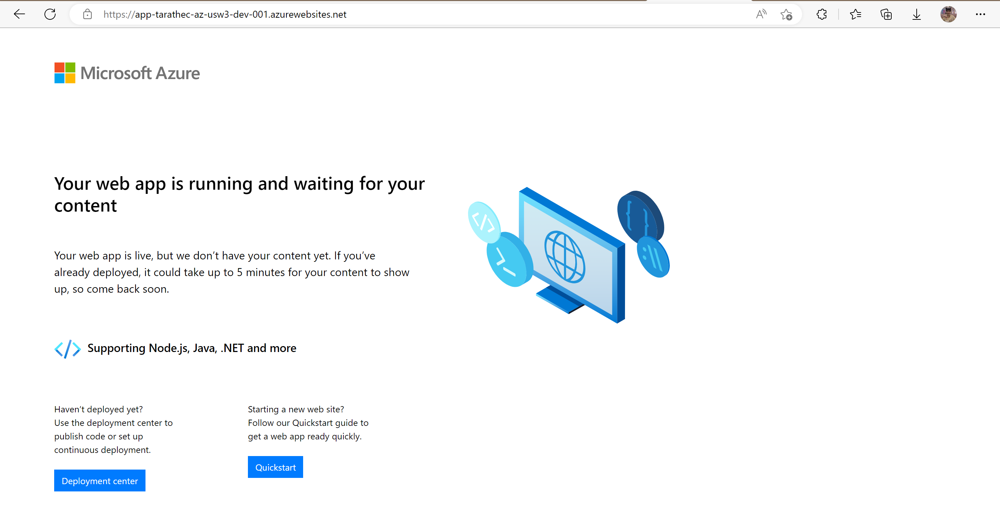</div>

Go back to portal and open the Cloud Shell to deploy application by click logo cloud shell on the top right-hand side.

<div align="center">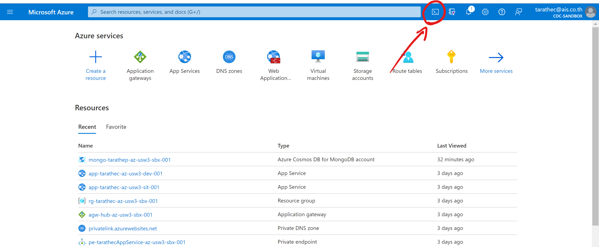</div>

Open Cloud Shell in bash mode

<div align="center">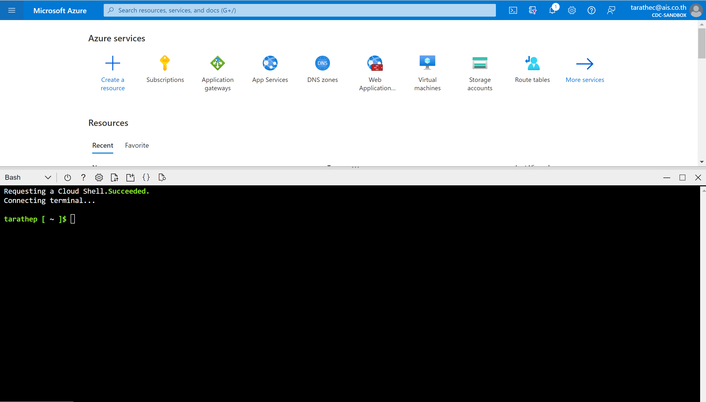</div>

use AZ Command to login.

```bash
az login --tenant xxxxxxxx-xxxx-xxxx-xxxx-xxxxxxxxxxxx
```

<div align="center">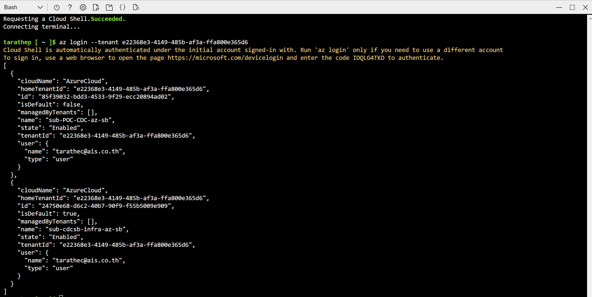</div>

Set subscription.

```bash
az account set --subscription sub-xxx-xxx-az-sb
```

Check access resource.

```bash
az resource list --name 'app-<username>-az-<region>-dev-001'
```

<div align="center"></div>

Checkout code from GitHub to Cloud Shell

```bash
git clone https://github.com/username/username-tutorial-backend.git
```

```bash
cd username-tutorial-backend/Tutorial.Api
```

<div align="center">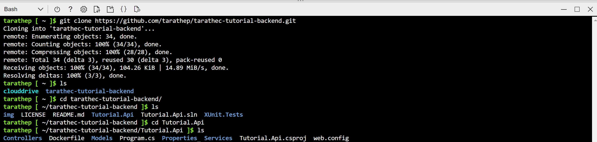</div>

Build release artifact with command

```bash
dotnet restore
```

```bash
dotnet publish -c Release -o out
```

```bash
cd out
```

<div align="center">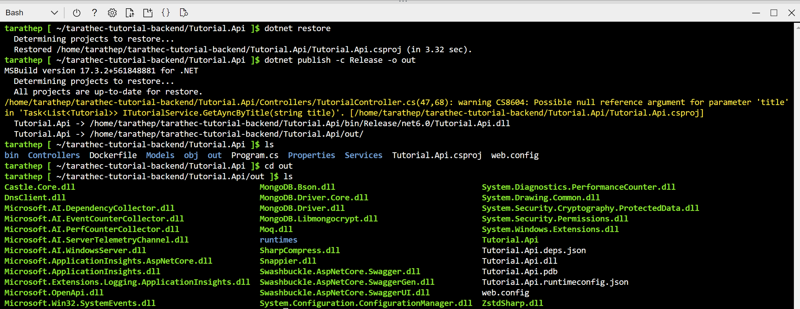</div>

you can see in files out directory and use command to zip all files

```bash
zip -r release.zip .
```

in this directory will find `release.zip` to deploy

<div align="center"></div>

deploy to Azure Webapp with command

This command is in preview and under development. Reference and support levels: [Reference types, status and support levels – Azure CLI](https://aka.ms/CLI_refstatus)

```bash
az webapp deploy --resource-group rg-<username>-az-<region>-sbx-001 --name app-<username>-az-<region>-dev-001 --type zip --src-path release.zip
```

<div align="center">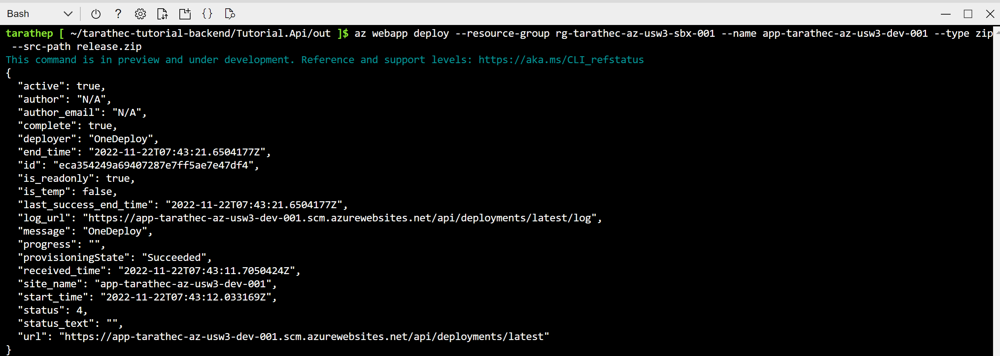</div>


For configuration app via command

Environment variables

|Env Name|Value|
|---|---|
|TutorialDatabase__ConnectionString|mongodb://xxxxxxxx|
|TutorialDatabase__DatabaseName|tutorialdb|
|TutorialDatabase__TutorialCollectionName|tutorials|

```bash
az webapp config appsettings set --resource-group rg-<username>-az-<region>-sbx-001 --name app-<username>-az-<region>-dev-001 --settings TutorialDatabase__ConnectionString=''
az webapp config appsettings set --resource-group rg-<username>-az-<region>-sbx-001 --name app-<username>-az-<region>-dev-001 --settings TutorialDatabase__DatabaseName='dev-tutorial'
az webapp config appsettings set --resource-group rg-<username>-az-<region>-sbx-001 --name app-<username>-az-<region>-dev-001 --settings TutorialDatabase__TutorialCollectionName='tutorials'
```

more: [Deploy files to App Service - Azure App Service | Microsoft Learn](https://learn.microsoft.com/en-us/azure/app-service/deploy-zip?tabs=cli#deploy-a-zip-package)

<div align="center">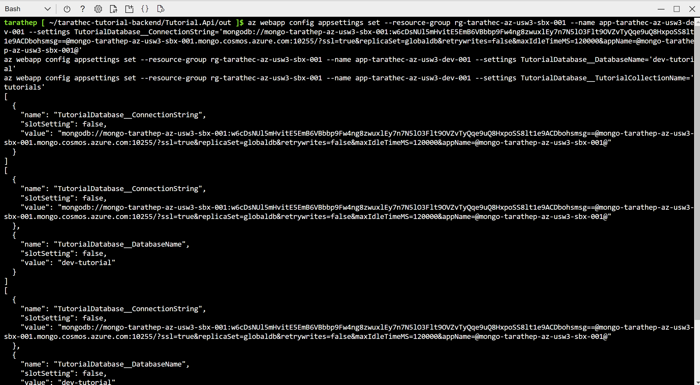</div>

<div align="center">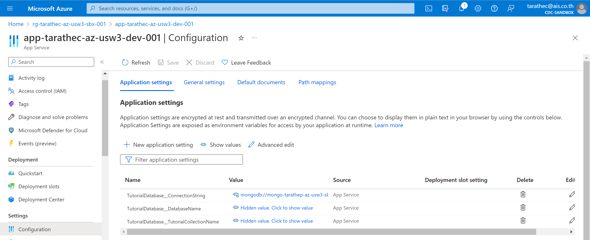</div>

## Test applications
Access via public internet with domain `https://app-username-az-<region>-dev-001.azurewebsites.net/swagger`

<div align="center">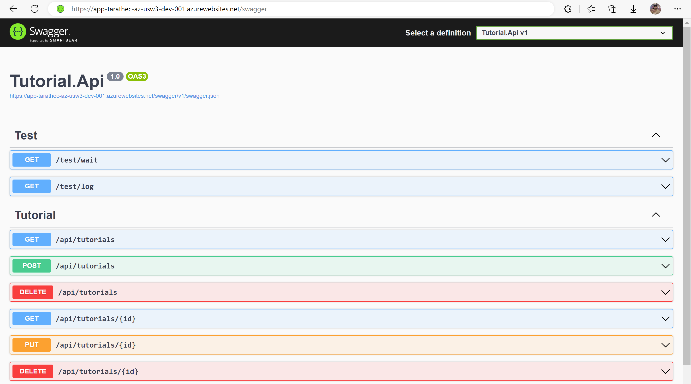</div>

on the POST : /api/tutorials

try to add value

```json
{
  "title": "asp.net",
  "description": "azure101"
}
```

<div align="center">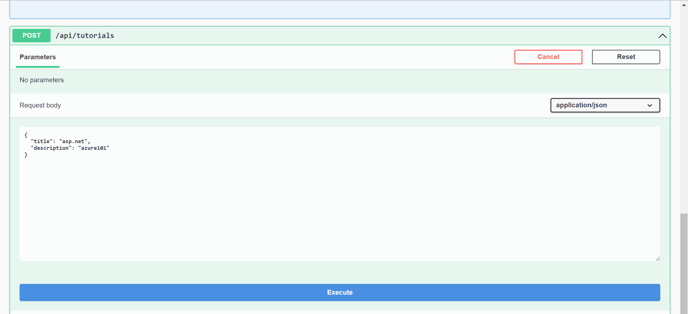</div>

and get to value

on the GET : `/api/tutorials`

<div align="center">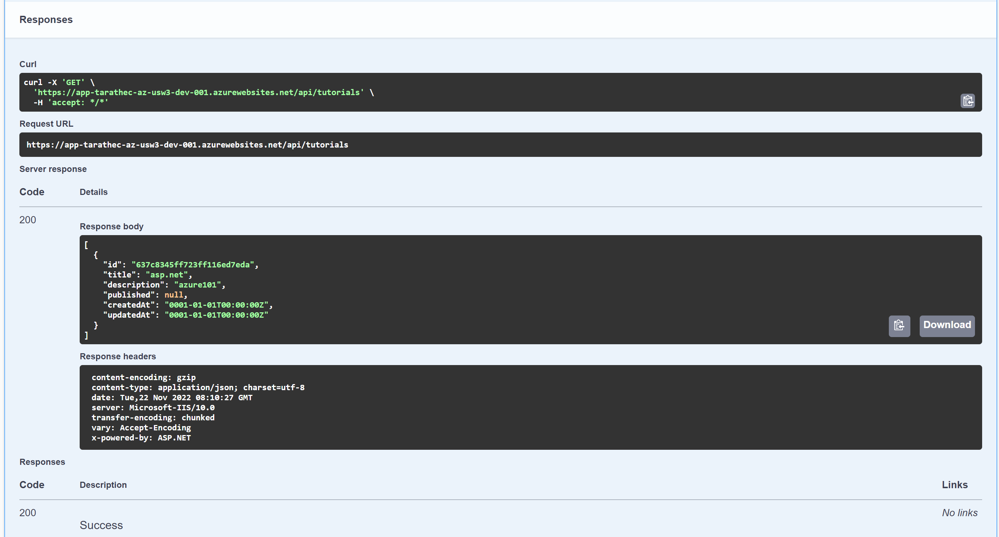</div>


and test GET to query data with URL `https://app-username-az-<region>-dev-001.azurewebsites.net>/api/tutorials`

<div align="center"></div>

Done :D


