# LAB 4 : Containerization with Docker

<div align="center">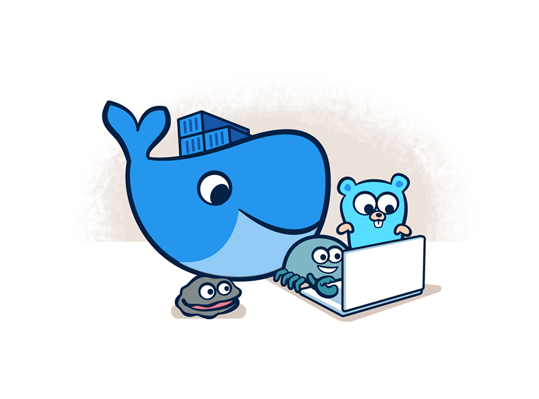</div>


Learn how application working and implementation concepts.

After completing this lab, you'll be able to:
- Explain containers app and image with docker concept.
- Explain how to use Dockerfile with application and reflector code to support container type.
- Can use basic command with docker to build, debug and publish to container registry.


In this lab we use sample application that is named `Tutorial API Backend` and `Tutorial Frontend` we focus on Backend application

## Prerequisites

- <b>Workspace that required Software and Tools</b> 
    - Git and GitHub Account
    - Text Editor (Required Visual Studio Code, or Visual Studio) [Visual Studio Code - Code Editing. Redefined](https://code.visualstudio.com/)
    - Docker CE (community Edition) [Docker Desktop - Docker](https://www.docker.com/products/docker-desktop/)
    - AZ CLI ([How to install the Azure CLI | Microsoft Learn](https://learn.microsoft.com/en-us/cli/azure/install-azure-cli))
- Requred lab2

## First Docker Command

On Windows OS start Docker Desktop

<div align="center">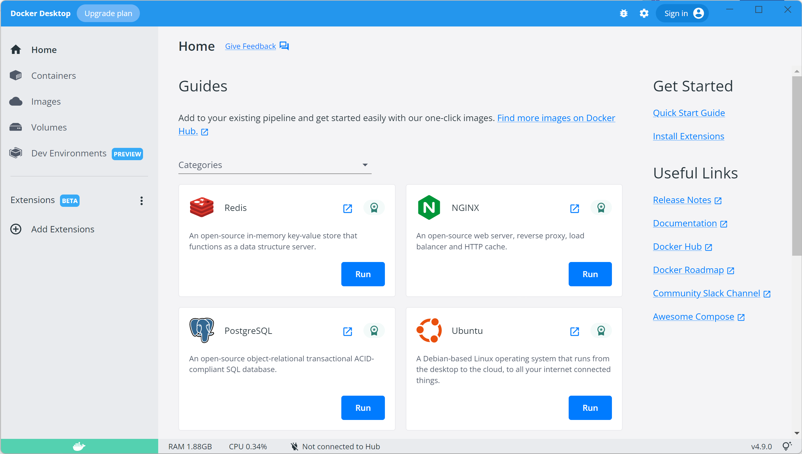</div>

Open the Terminal to use docker command and run command in below

to check version

```bash
docker version
```

<div align="center">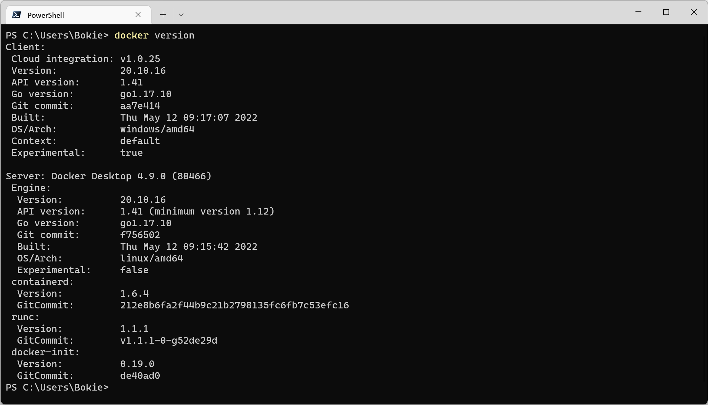</div>

<b>Assignment</b>

Pull image from nginx and run by expose on port 80 and access to localhost

[docker cheat sheet](https://www.docker.com/wp-content/uploads/2022/03/docker-cheat-sheet.pdf)

<div align="center">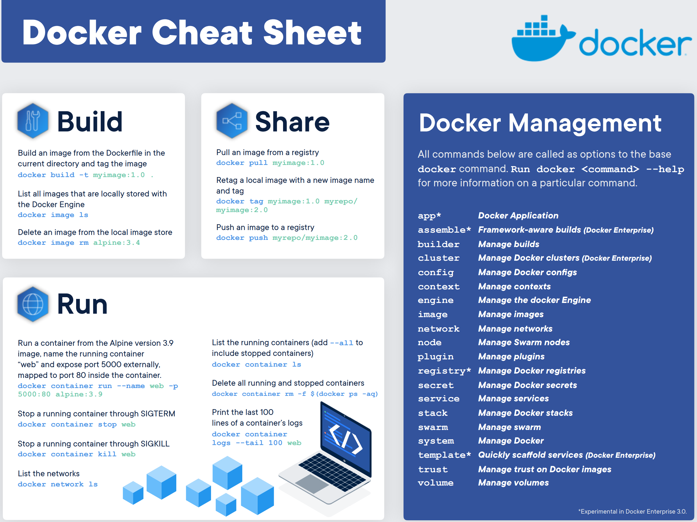</div>

## Working with Dockerfile

On the project <b>Tutorial API Backend</b>, you can download with your GitHub with command

```bash
git clone https://github.com/<username>/<username>-tutorial-backend.git
```

```bash
cd <username>-tutorial-backend
```

Open Visual Studio Code

<div align="center">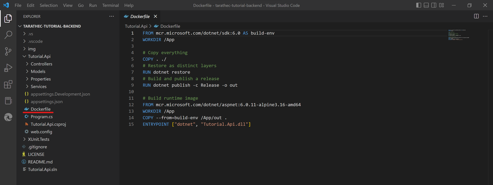</div>

You can see have Dockerfile into project

<b>Review Dockerfile</b>

```dockerfile
FROM mcr.microsoft.com/dotnet/sdk:6.0 AS build-env
WORKDIR /App

# Copy everything
COPY . ./
# Restore as distinct layers
RUN dotnet restore
# Build and publish a release
RUN dotnet publish -c Release -o out

# Build runtime image
FROM mcr.microsoft.com/dotnet/aspnet:6.0.11-alpine3.16-amd64
WORKDIR /App
COPY --from=build-env /App/out .
ENTRYPOINT ["dotnet", "Tutorial.Api.dll"]
 ```

Open Terminal and use command to

```bash
cd Tutorial.Api
ls
```

<div align="center">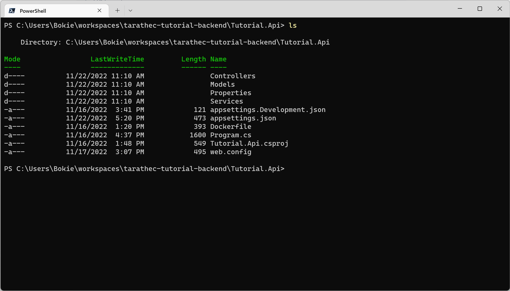</div>

<b>Build image</b>

```bash
docker build -t tutorial-be:0.0.1 .
```

<div align="center">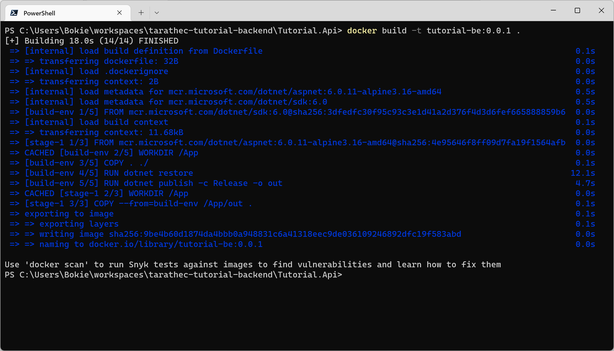</div>

Check Image to build

```bash
docker image ls
```

<div align="center">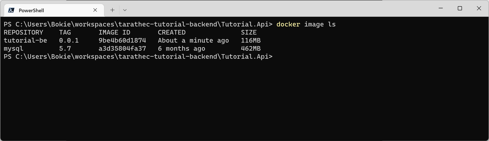</div>

Run image to container

```bash
docker run -it --rm --name tutorial-be -p 80:80 tutorial-be:0.0.1
```

<div align="center">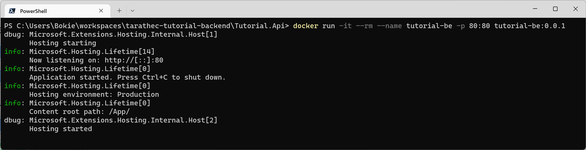</div>

Access to http://localhost/swagger

<div align="center">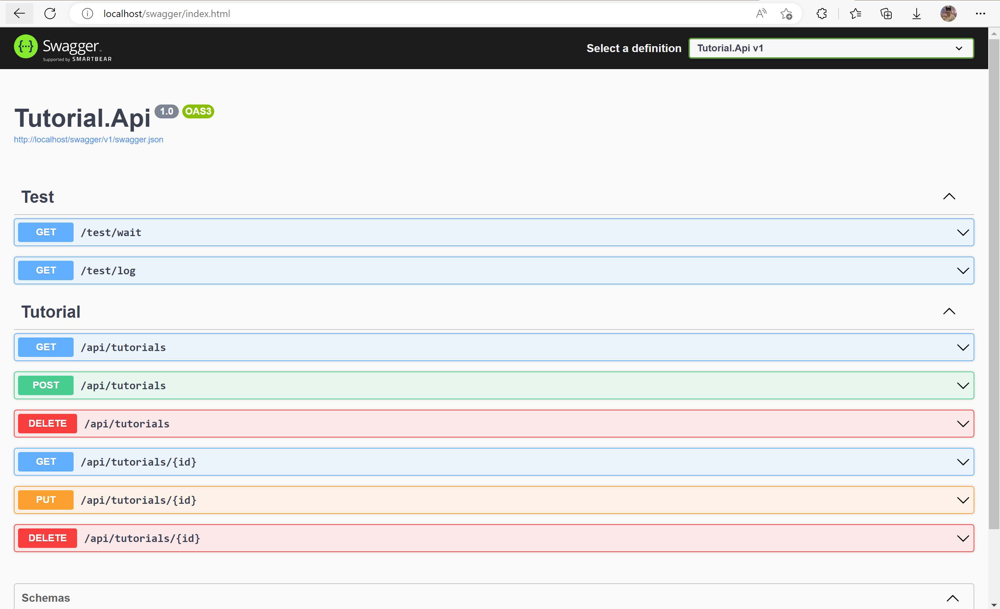</div>


If you want to try APIs, you must set configuration via Environment Variables

<b>Environment variables</b>

|Env Name|Value|
|---|---|
|TutorialDatabase__ConnectionString|mongodb://xxxxxxxx|
|TutorialDatabase__DatabaseName|tutorial|
|TutorialDatabase__TutorialCollectionName|tutorials|
|ApplicationInsights__ConnectionString|…|

<b><i>Option -e</i></b>

example

```bash
docker run -it --rm --name tutorial-be -p 80:80 -e TutorialDatabase__ConnectionString='mongodb://xxxxxxxx' -e TutorialDatabase__DatabaseName='dev-tutorial' tutorial-be:0.0.1
```

## Working on Container Registry

focusing on GitHub Container Registry

On GitHub, you can see on Packages to store artifact package included to docker image.

<div align="center">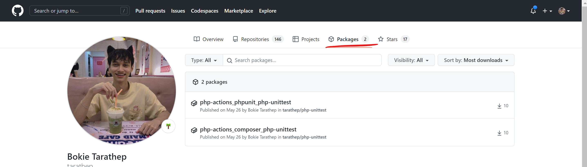</div>

This is a private container registry that when you use must log in

we want to push image to private registry `ghcr.io`

Login docker

```bash
docker login ghcr.io -u <username> --password ghp_xxxxxxxxxxxx
```

<div align="center">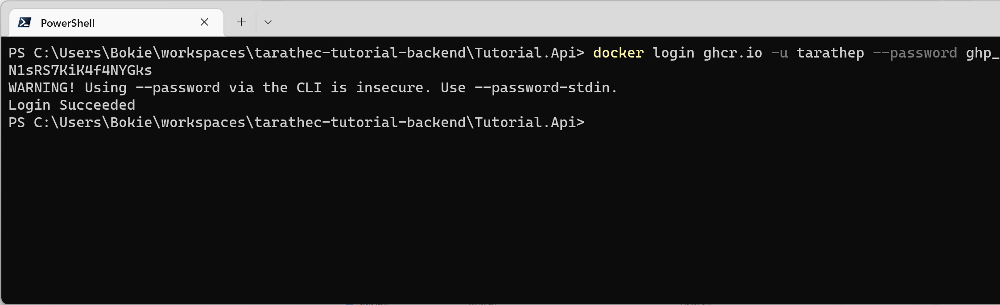</div>

for to generate GitHub personal token credential to auth

go to the GitHub page and top right corner click on image profile and select

<i>Settings > Developer settings ></i>

<div align="center">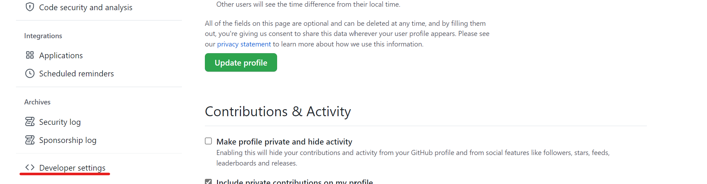</div>

Select Generate new token (classic)

<div align="center">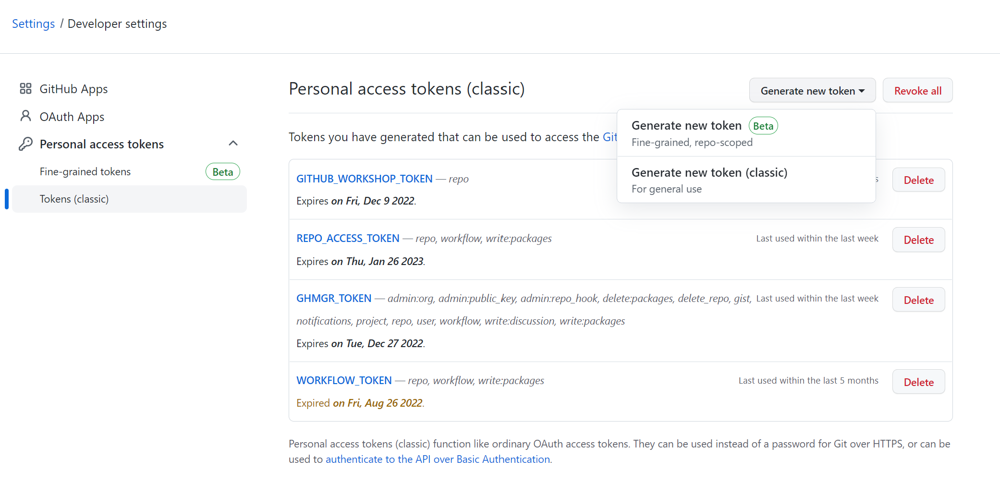</div>

Enter on Note: `Azure101`

and Select scopes

- repo
- workflow
- write: package
- delete: package

and then click Generate Token Button

<div align="center">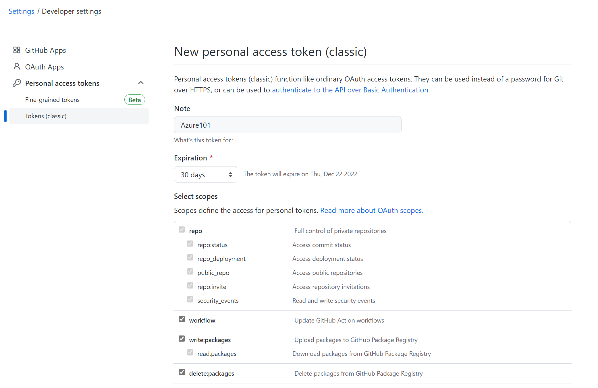</div>

Before push image to ghcr.io you must change the image name with docker tag

```bash
docker tag tutorial-be:0.0.1 ghcr.io/<username>/tutorial-be:0.0.1
```

Push image to ghcr.io

```bash
docker push ghcr.io/<username>/tutorial-be:0.0.1
```

<div align="center">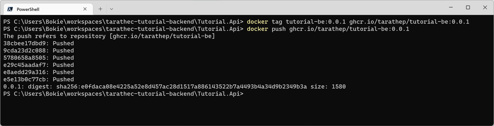</div>

Checking on your GitHub package on GitHub Page, you can see `tutorial-be` image.

<div align="center">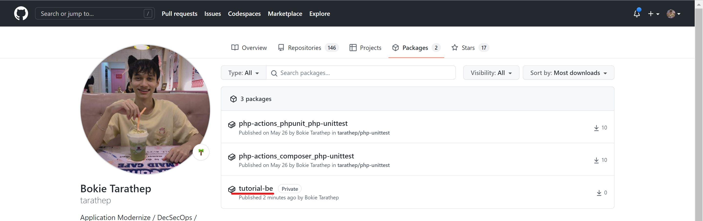</div>

<div align="center">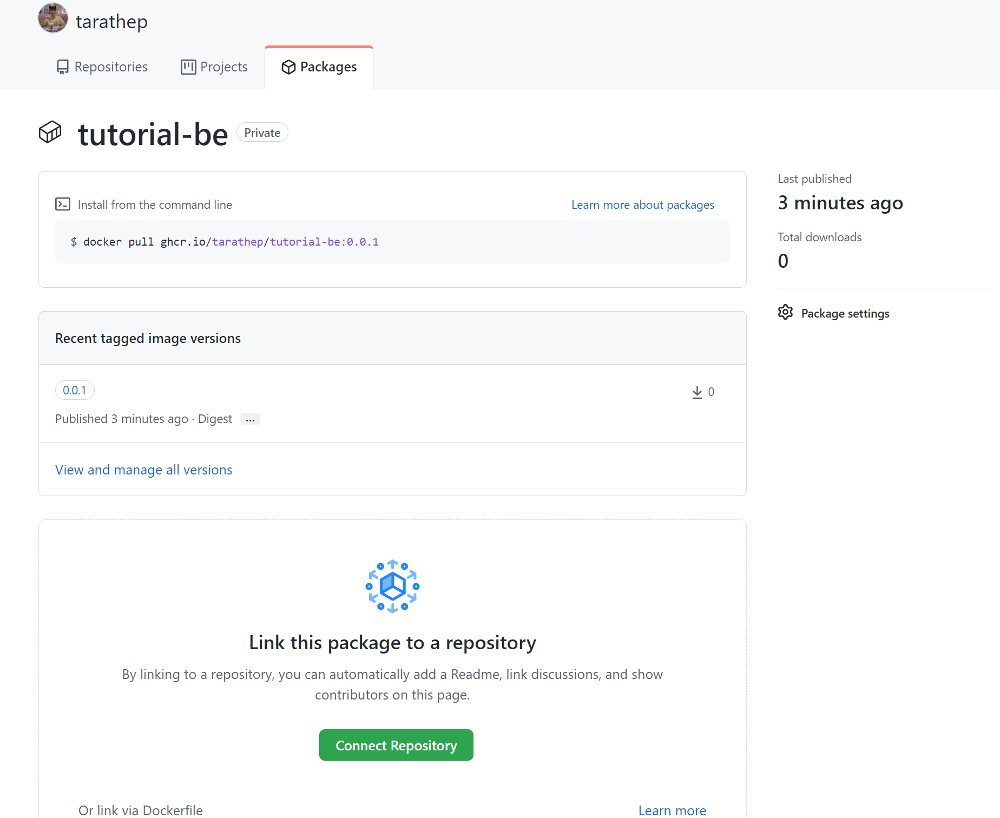</div>


Done :D