# LAB 3 : Implement workflows deploy to App service SIT Environment

<div align="center">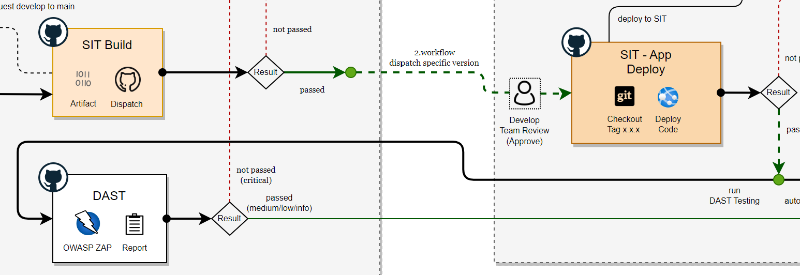</div>

Learn how continuous deployment or delivery application to Azure that working on GitHub Actions and implementation basic concepts.


After completing this lab, you'll be able to:

- Explain and Implement CD workflows with GitHub Actions in fundamental.
- Explain Branching strategy working with each environment.
- Automation workflows and how to use GitHub Actions.
- Investigate and solvable working on pipeline.

## Prerequisites

- <b>Workspace that required Software and Tools</b> 
    - Git and GitHub Account
    - Text Editor (Required Visual Studio Code, or Visual Studio) [Visual Studio Code - Code Editing. Redefined](https://code.visualstudio.com/)
    - AZ CLI ([How to install the Azure CLI | Microsoft Learn](https://learn.microsoft.com/en-us/cli/azure/install-azure-cli))
- <b>Infrastructures or Resources on Azure</b>
    - Azure App service (Webapp support deploy code and dotnet6) 
    - Azure App service plan (Windows or Linux)
    - Azure Cosmos DB for MongoDB API (Step for Initialize cosmos DB)
    - Azure Key Vault (if any)
    - Azure Application Insights (if any)
- Required Lab2

## Checking Resources Ready

On the Azure Spoke checking list below
- `app-<username>-az-<region>-dev-001`
- `app-<username>-az-<region>-sit-001`
- `id-<username>SelfHost-az-<region>-sbx-001`
- `mongo-<username>-az-<region>-sbx-001`
- `vm-<username>SelfHost-az-<region>-sbx-001`

<div align="center"></div>


## Initialize GitHub workflow.

Checkout the source code from GitHub `github.com/<username>/<username>-pipeline`.

Open the terminal following command below.

```bash
git clone https://github.com/<username>/<username>-pipeline.git
```

Open the project with text editor (Visual Studio Code) and create new folder named `github/workflows `in root directory of project (git).

```bash
mkdir .github/workflows
```
<div align="center"></div>

GitHub workflow is working on inside `.github/workflows` that contains GitHub workflows files that extension named `.yaml`

## Create SIT - Tutorial BE Deploy workflows

On Create `SIT - Tutorial BE Deploy` workflows is working when manual workflows dispatch will automate deploy to Azure Webapp.

<div align="center"></div>

Create the new file named `sit-tutorial-be-deploy.yml` inside `.github/workflows` this on the Workflows SIT which contain 1 workflow SIT Deploy.

<div align="center">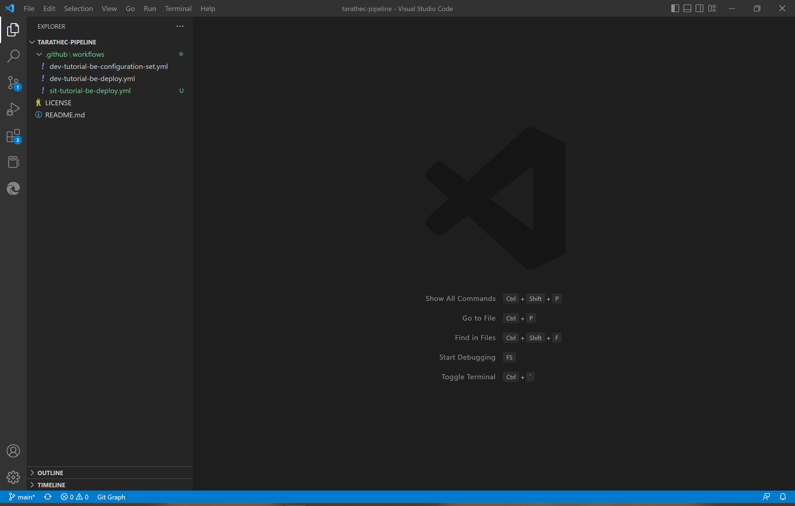</div>


### Name

The first name starts with declare name of workflows

```yaml
name: SIT - Tutorial BE Deploy
```

### On (Events that trigger workflows)

Enter events when do you want to execute or trigger the workflows

you can see more of event type at [Events that trigger workflows - GitHub Docs](https://docs.github.com/en/actions/using-workflows/events-that-trigger-workflows)

```yaml
on:
  workflow_dispatch:
    inputs:
      ref:
        description: "Repository branch or tag"
        required: true
        default: "v1.0.0"
```

### Env

the environment global to declaration and variables

```yaml
env:
  REPOSITORY: "<username>/<username>-tutorial-backend"
  GITREF: ${{ github.event.inputs.ref }}
  ARTIFACT_NAME: "artifact-tutorial-backend"
  APP_RESOURCE_NAME: app-<username>-az-<region>-sit-001

```

### Jobs

Groups together all the jobs that run in the `SIT - Tutorial BE Deploy` workflow.

```yaml
jobs:
...

```

### Deploy

The artifact deploy to contains in the job

```yaml
  deploy-app-service:
    name: Deploy
    runs-on: [ self-hosted, tutorial-be-dev, vm-<username>SelfHost-az-<region>-sbx-001 ]
    environment:
      name: sit
      url: https://app-<username>-az-<region>-sit-001.azurewebsites.net/swagger/index.html
```

#### Steps

```yaml
    steps:
    - name: Download Artifact
      uses: robinraju/release-downloader@v1.7
      with:
        repository: ${{ env.REPOSITORY }}
        tag: ${{ env.GITREF }}
        fileName: ${{ env.ARTIFACT_NAME }}-${{ env.GITREF }}.tar.gz
        token: ${{ secrets.WORKFLOW_TOKEN }}

    - name: Extract Artifact
      run : |
        mkdir -p ${{ env.ARTIFACT_NAME }}-${{ env.GITREF }}
        tar -zxf ${{ github.workspace }}/${{ env.ARTIFACT_NAME }}-${{ env.GITREF }}.tar.gz -C ${{ github.workspace }}/${{ env.ARTIFACT_NAME }}-${{ env.GITREF }}
        rm ${{ github.workspace }}/${{ env.ARTIFACT_NAME }}-${{ env.GITREF }}.tar.gz
    
    - name: Login via Azure CLI
      run: |
        az login --identity --username ${{ secrets.AZURE_SELFHOST_USER_MANAGE_IDENTITY_CLIENT_ID }}
        az account set --subscription ${{ secrets.AZURE_SUBSCRIPTION_ID }}
    
    - name: Deploy to Azure WebApp
      uses: azure/webapps-deploy@v2
      with:
        app-name: ${{ env.APP_RESOURCE_NAME }}
        package: ${{ github.workspace }}/${{ env.ARTIFACT_NAME }}-${{ env.GITREF }}

    - name: Clear Cache
      run: |
        rm -rf ${{ github.workspace }}/${{ env.ARTIFACT_NAME }}-${{ env.GITREF }}

    - name: DAST (OWASP ZAP) Dispatch
      uses: peter-evans/repository-dispatch@v1
      with:
        token: ${{ secrets.WORKFLOW_TOKEN }}
        repository: ${{ env.REPOSITORY }}
        event-type: <username>-tutorial-be-dast-sit
        client-payload: '{"ref": "${{ github.ref }}", "sha": "${{ github.sha }}"}'

```

<div align="center">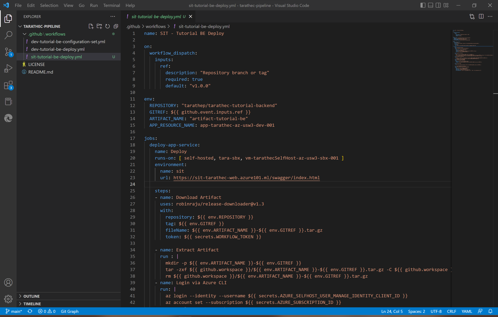</div>

Commit and push code to GitHub repository on `main` branch.

Go back to repository `<username>-pipeline` on tab Actions you can see workflow named `SIT - Tutorial BE Deploy` visible

<div align="center">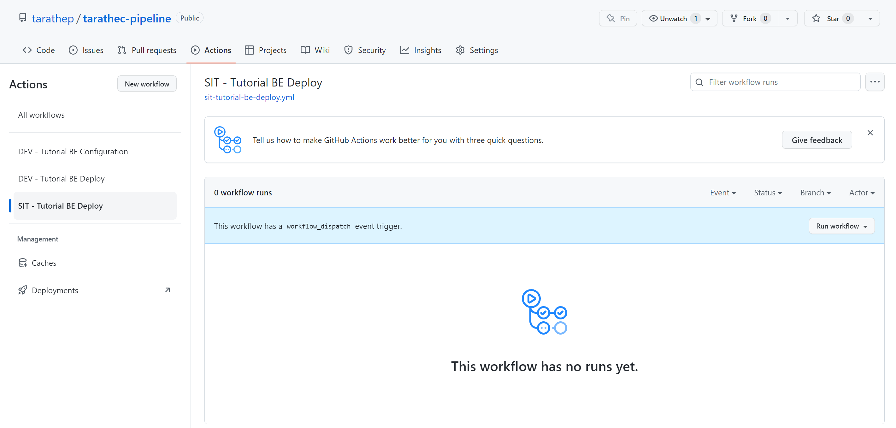</div>

before running this workflow, you must config variable secrets at <i>Settings > Environments > sit</i>

if you don't found environment named `sit` you can click create `New environment` button and enter `sit`

<div align="center">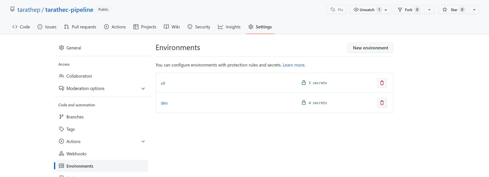</div>

click on environment sit name to set Environment secrets

<b>Enter</b>

- Name: WORKFLOW_TOKEN
    - Value: ghp_xxxxxxxxxxxxxxxxx
- Name: AZURE_SELFHOST_USER_MANAGE_IDENTITY_CLIENT_ID
    - Value: xxxxxxxx-xxxx-xxxx-xxxx-xxxxxxxxxxxx
- Name: AZURE_SUBSCRIPTION_ID
    - Value: xxxxxxxx-xxxx-xxxx-xxxx-xxxxxxxxxxxx

<div align="center"></div>


Go back to Actions tab and run workflows `SIT - Tutorial BE Deploy`.

<div align="center">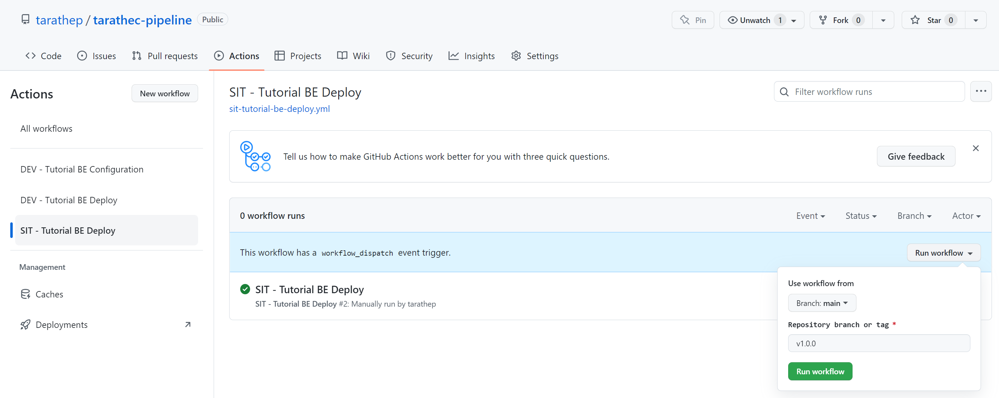</div>

<div align="center">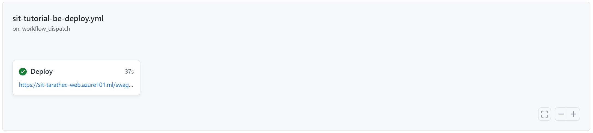</div>


<b>Summary Code</b>

```yaml
name: SIT - Tutorial BE Deploy

on:
  workflow_dispatch:
    inputs:
      ref:
        description: "Repository branch or tag"
        required: true
        default: "v1.0.0"

env:
  REPOSITORY: "<username>/<username>-tutorial-backend"
  GITREF: ${{ github.event.inputs.ref }}
  ARTIFACT_NAME: "artifact-tutorial-backend"
  APP_RESOURCE_NAME: app-<username>-az-<region>-sit-001

jobs:
  deploy-app-service:
    name: Deploy
    runs-on: [ self-hosted, <username>-sbx, vm-<username>SelfHost-az-<region>-sbx-001 ]
    environment:
      name: sit
      url: https://sit-<username>-web.azure101.ml/swagger/index.html
    
    steps:
    - name: Download Artifact
      uses: robinraju/release-downloader@v1.3
      with:
        repository: ${{ env.REPOSITORY }}
        tag: ${{ env.GITREF }}
        fileName: ${{ env.ARTIFACT_NAME }}-${{ env.GITREF }}.tar.gz
        token: ${{ secrets.WORKFLOW_TOKEN }}

    - name: Extract Artifact
      run : |
        mkdir -p ${{ env.ARTIFACT_NAME }}-${{ env.GITREF }}
        tar -zxf ${{ github.workspace }}/${{ env.ARTIFACT_NAME }}-${{ env.GITREF }}.tar.gz -C ${{ github.workspace }}/${{ env.ARTIFACT_NAME }}-${{ env.GITREF }}
        rm ${{ github.workspace }}/${{ env.ARTIFACT_NAME }}-${{ env.GITREF }}.tar.gz
    - name: Login via Azure CLI
      run: |
        az login --identity --username ${{ secrets.AZURE_SELFHOST_USER_MANAGE_IDENTITY_CLIENT_ID }}
        az account set --subscription ${{ secrets.AZURE_SUBSCRIPTION_ID }}
    - name: Deploy to Azure WebApp
      uses: azure/webapps-deploy@v2
      with:
        app-name: ${{ env.APP_RESOURCE_NAME }}
        package: ${{ github.workspace }}/${{ env.ARTIFACT_NAME }}-${{ env.GITREF }}

    - name: Clear Cache
      run: |
        rm -rf ${{ github.workspace }}/${{ env.ARTIFACT_NAME }}-${{ env.GITREF }}

    - name: DAST (OWASP ZAP) Dispatch
      uses: peter-evans/repository-dispatch@v1
      with:
        token: ${{ secrets.WORKFLOW_TOKEN }}
        repository: ${{ env.REPOSITORY }}
        event-type: <username>-tutorial-be-dast-sit
        client-payload: '{"ref": "${{ github.ref }}", "sha": "${{ github.sha }}"}'

```

<b>Logging</b>

<div align="center">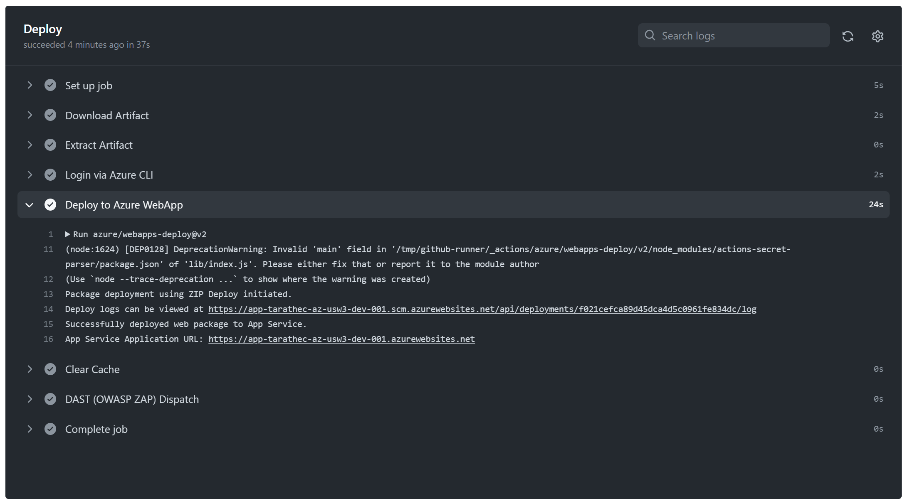</div>

## Create SIT - Configuration Set workflows

Configuration to deploy to Azure Web App.

<div align="center"></div>

Create the new file named `sit-tutorial-be-configuration-set.yml` inside `.github/workflows` this on the Workflows which contains configure to App service (Webapp)

<div align="center">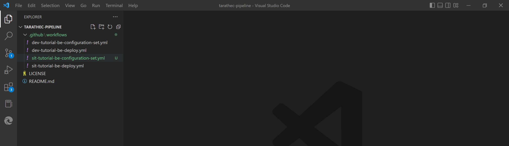</div>

### Name

The first name starts with declare name of workflows

```yaml
name: SIT - Tutorial BE Configuration
```

### On (Events that trigger workflows)

Enter events when do you want to execute or trigger the workflows

you can see more of event type at [Events that trigger workflows - GitHub Docs](https://docs.github.com/en/actions/using-workflows/events-that-trigger-workflows)

```yaml
on:
  workflow_dispatch:
```

### Jobs

Groups together all the jobs that run in the `DEV - Tutorial BE Deploy` workflow.

```yaml
jobs:
...

```

### Set Configuration

The build artifact to contains in the job

```yaml
  set-configuration:
    name: set appservice configuration
    runs-on: [ self-hosted, tutorial-be-dev, vm-<username>SelfHost-az-<region>-sbx-001 ]
    environment: sit

```

#### step

```yaml
    steps:
    - name: Login via Azure CLI
      run: |
        az login --identity --username ${{ secrets.AZURE_SELFHOST_USER_MANAGE_IDENTITY_CLIENT_ID }}
        az account set --subscription ${{ secrets.AZURE_SUBSCRIPTION_ID }}

    - name: Set Web App Settings
      uses: Azure/appservice-settings@v1
      with:
        app-name: app-<username>-az-<region>-sit-001
        app-settings-json: |
          [
            {
              "name": "TutorialDatabase__ConnectionString",
              "value": "${{ secrets.TUTORIAL_DB_CONNECTION_STRING }}",
              "slotSetting": false
            },
            {
              "name": "TutorialDatabase__DatabaseName",
              "value": "sit-tutorial",
              "slotSetting": false
            },
            {
              "name": "TutorialDatabase__TutorialCollectionName",
              "value": "tutorials",
              "slotSetting": false
            }
          ]

```

<div align="center">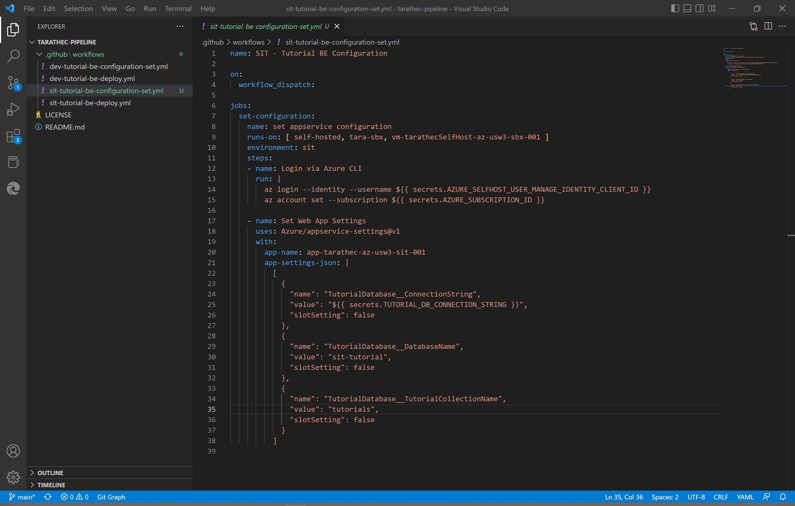</div>

Commit and push code to GitHub repository on `main` branch.

Go back to repository `<username>-pipeline` on tab Actions you can see workflow named `SIT - Tutorial BE Configuration` visible

<div align="center">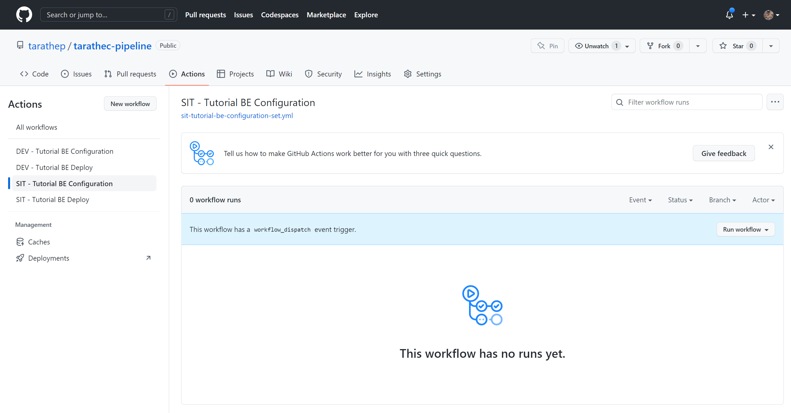</div>

before running this workflow, you must config variable secret at <i>Settings > Environments > sit</i>

<b>Enter</b>

- Name : `TUTORIAL_DB_CONNECTION_STRING`
- Value : `mongodb://...`

<div align="center">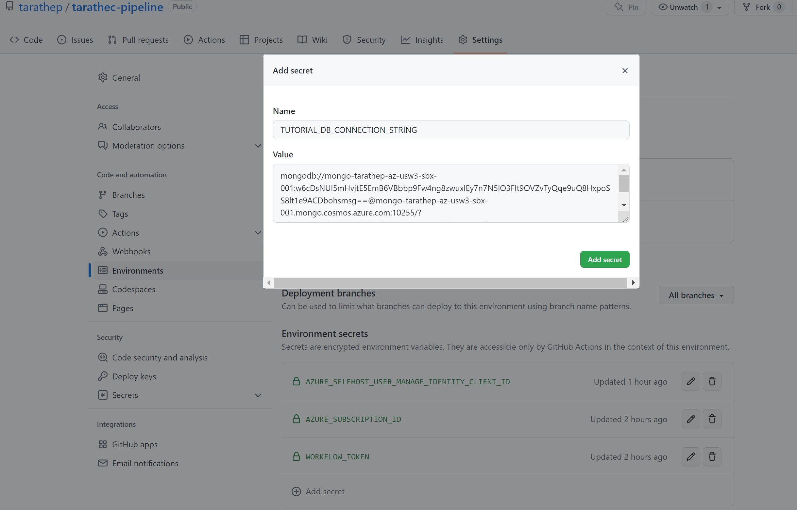</div>

And go back to Actions tab and run workflows `SIT - Tutorial BE Configuration`.

<div align="center">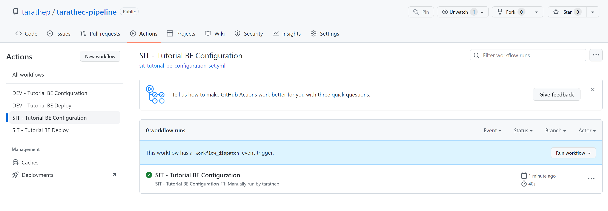</div>

<div align="center">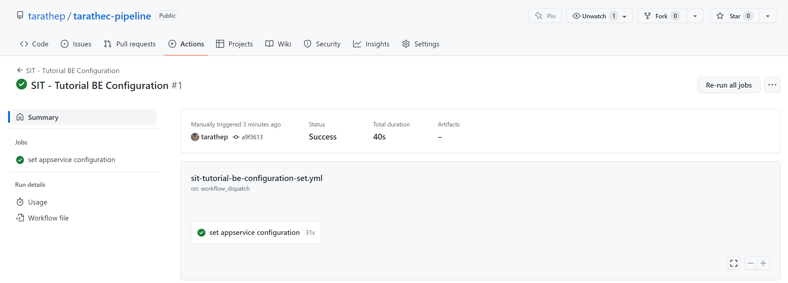</div>

Result of output to set on Configuration Webapp.

<div align="center">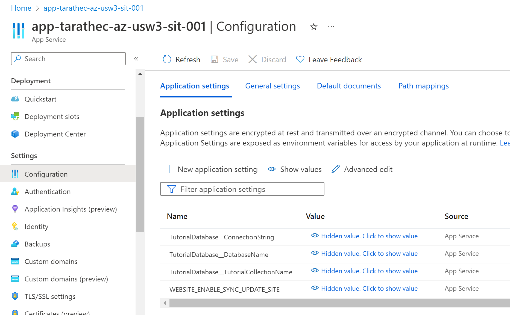</div>

Try to access via URL `https://app-<username>-az-<region>-sit-001.azurewebsites.net/swagger/index.html`

<div align="center">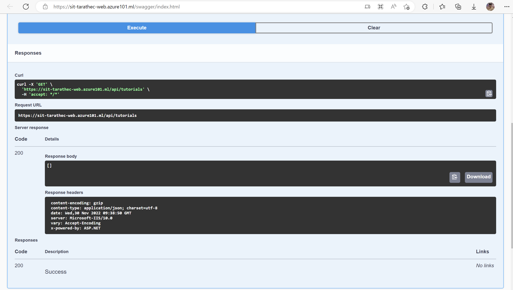</div>

<b>Summary Code</b>

```yaml
name: SIT - Tutorial BE Configuration

on:
  workflow_dispatch:

jobs:
  set-configuration:
    name: set appservice configuration
    runs-on: [ self-hosted, <username>-sbx, vm-<username>SelfHost-az-<region>-sbx-001 ]
    environment: sit
    steps:
    - name: Login via Azure CLI
      run: |
        az login --identity --username ${{ secrets.AZURE_SELFHOST_USER_MANAGE_IDENTITY_CLIENT_ID }}
        az account set --subscription ${{ secrets.AZURE_SUBSCRIPTION_ID }}

    - name: Set Web App Settings
      uses: Azure/appservice-settings@v1
      with:
        app-name: app-<username>-az-<region>-sit-001
        app-settings-json: |
          [
            {
              "name": "TutorialDatabase__ConnectionString",
              "value": "${{ secrets.TUTORIAL_DB_CONNECTION_STRING }}",
              "slotSetting": false
            },
            {
              "name": "TutorialDatabase__DatabaseName",
              "value": "sit-tutorial",
              "slotSetting": false
            },
            {
              "name": "TutorialDatabase__TutorialCollectionName",
              "value": "tutorials",
              "slotSetting": false
            }
          ]
          

```

<b>Logging</b>

<div align="center">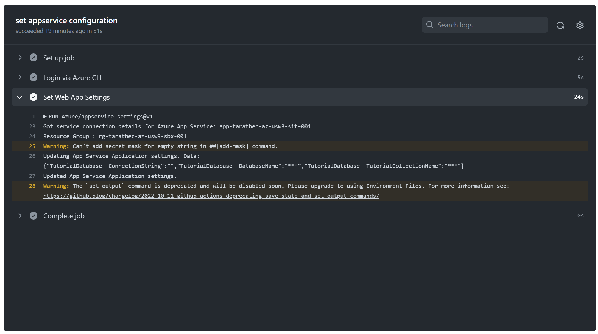</div>


## DAST workflows (Dynamic Application Security Testing)

On DAST workflows is working after SIT deploy succeeded that based on [OWASP ZAP](https://www.zaproxy.org/) tool

<div align="center">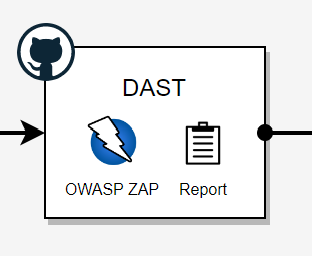</div>

this workflow locates on CI repository you will add workflow at` https://github.com/<username>/<username>/tutorial-backend`

Download and Open `tutorial-backend` project with Visual Studio Code

```yaml
git clone https://github.com/<username>/<username>/tutorial-backend
```

```yaml
cd <username>/tutorial-backend
```

```yaml
code .
```

Switch branch from `main` to `develop`

```yaml
git branch
```

```yaml
git checkout develop
```

Inside `.github/workflows` directory.

Create the new file named `dast-tests.yaml` inside `.github/workflows`

<div align="center">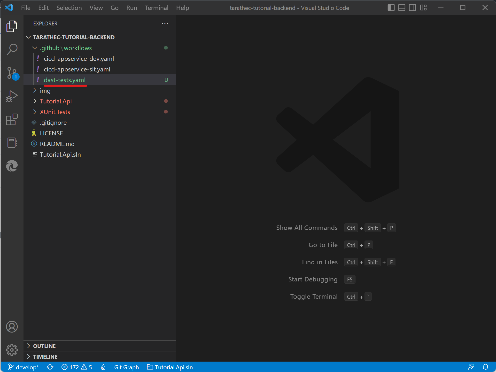</div>

### Name

The first name starts with declare name of workflows

```yaml
name: DAST OWSAP ZAP (No auth)
```

### On (Events that trigger workflows)

Enter events when do you want to execute or trigger the workflows

you can see more of event type at [Events that trigger workflows - GitHub Docs](https://docs.github.com/en/actions/using-workflows/events-that-trigger-workflows)

```yaml
on:
  repository_dispatch:
    types: [<username>-tutorial-be-dast-sit]
  workflow_dispatch:
    inputs:
      env:
        description: Environment
        required: true
        default: 'sit'

```

### Jobs

Groups together all the jobs that run in the `SIT - Tutorial BE Deploy` workflow.

```yaml
jobs:
...

```

#### DAST Scan

The DAST SCAN to contain in jobs

```yaml
  dast_zap_scan:
    name: DAST (OWASP ZAP)
    runs-on: ubuntu-latest
    environment: ${{ github.event_name == 'repository_dispatch' && 'sit' || github.event.inputs.env }}
    permissions:
      actions: read
      contents: read
      security-events: write
      issues: write
```

#### Steps

```yaml
    steps:
    - name: ZAP Scan
      uses: zaproxy/action-baseline@v0.7.0
      with:
        token: ${{ secrets.GITHUB_TOKEN }}
        target: https://app-<username>-az-<region>-${{ github.event_name == 'repository_dispatch' && 'sit' || github.event.inputs.env }}-001.azurewebsites.net/api/tutorials
            
    - name: Create sarif file from zaproxy results
      uses: SvanBoxel/zaproxy-to-ghas@main
    
    - name: Upload SARIF file
      uses: github/codeql-action/upload-sarif@v2
      with:
          sarif_file: results.sarif

```

<div align="center">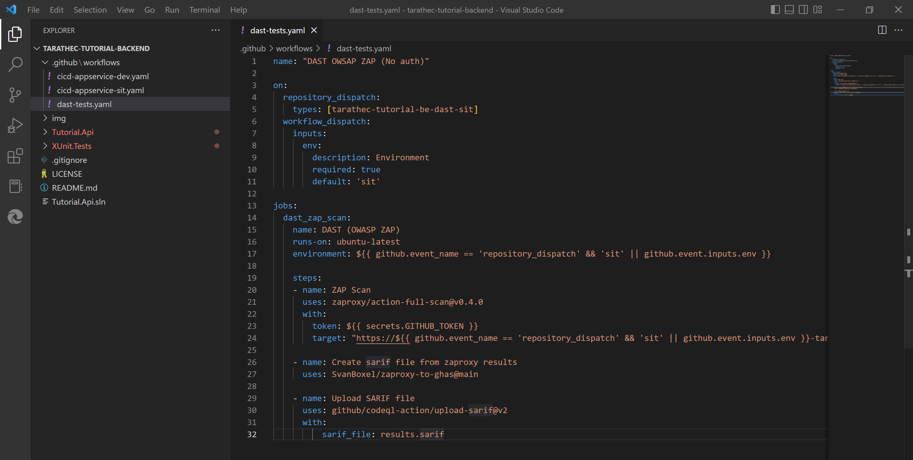</div>

<B>Commit and push</b> code to GitHub repository on <b>develop</b> branch and merge to <b>main</b> branch.

Go back to repository `<username>/<username>-tutorial-backend` on tab Actions, you can see workflow named `DAST OWASP ZAP (No auth) `visible.

Run workflow enter environment to scanning

<div align="center">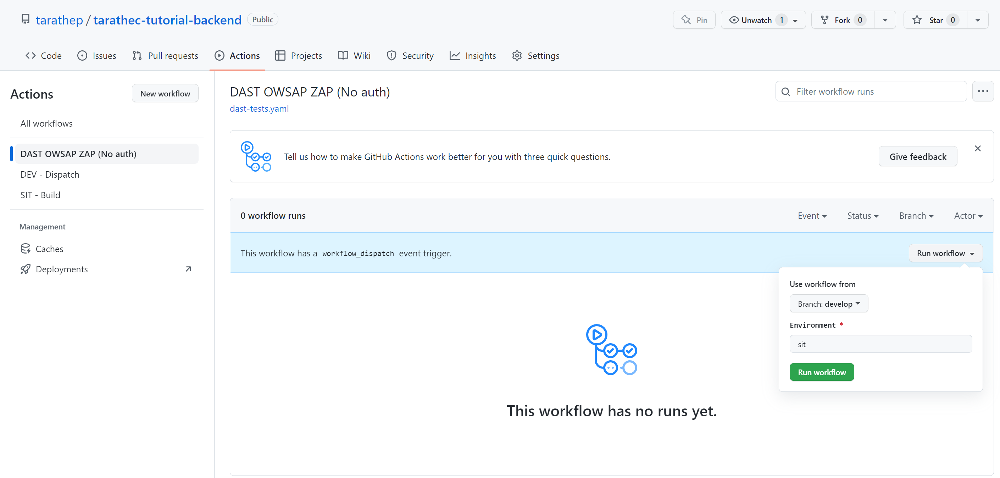</div>

<div align="center">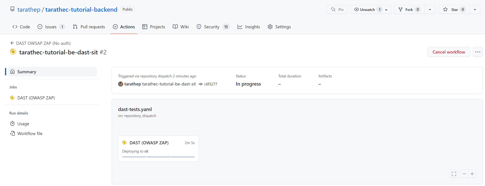</div>

<div align="center"></div>

<B>Report OWASP ZAP</B>

<div align="center">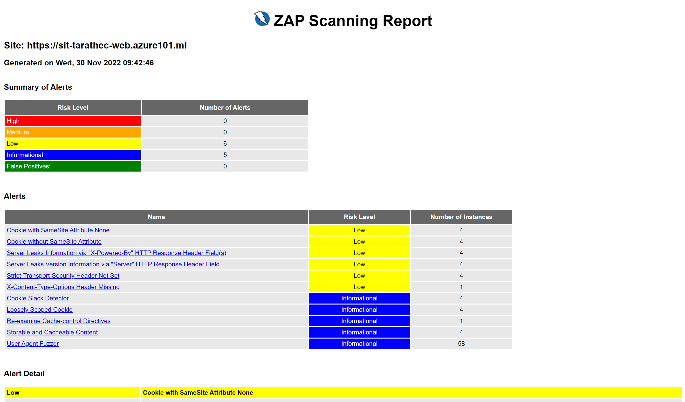</div>

<b>Summary Code</b>

```yaml
name: "DAST OWSAP ZAP (No auth)"

on:
  repository_dispatch:
    types: [<username>-tutorial-be-dast-sit]
  workflow_dispatch:
    inputs:
      env:
        description: Environment
        required: true
        default: 'sit'

jobs:
  dast_zap_scan:
    name: DAST (OWASP ZAP)
    runs-on: ubuntu-latest
    environment: ${{ github.event_name == 'repository_dispatch' && 'sit' || github.event.inputs.env }}
    permissions:
      actions: read
      contents: read
      security-events: write
      issues: write

    steps:
    - name: ZAP Scan
      uses: zaproxy/action-baseline@v0.7.0
      with:
        token: ${{ secrets.GITHUB_TOKEN }}
        target: https://app-<username>-az-<region>-${{ github.event_name == 'repository_dispatch' && 'sit' || github.event.inputs.env }}-001.azurewebsites.net/api/tutorials
        
    - name: Create sarif file from zaproxy results
      uses: SvanBoxel/zaproxy-to-ghas@main
    
    - name: Upload SARIF file
      uses: github/codeql-action/upload-sarif@v2
      with:
          sarif_file: results.sarif

```

<b>Logging</b>

<div align="center">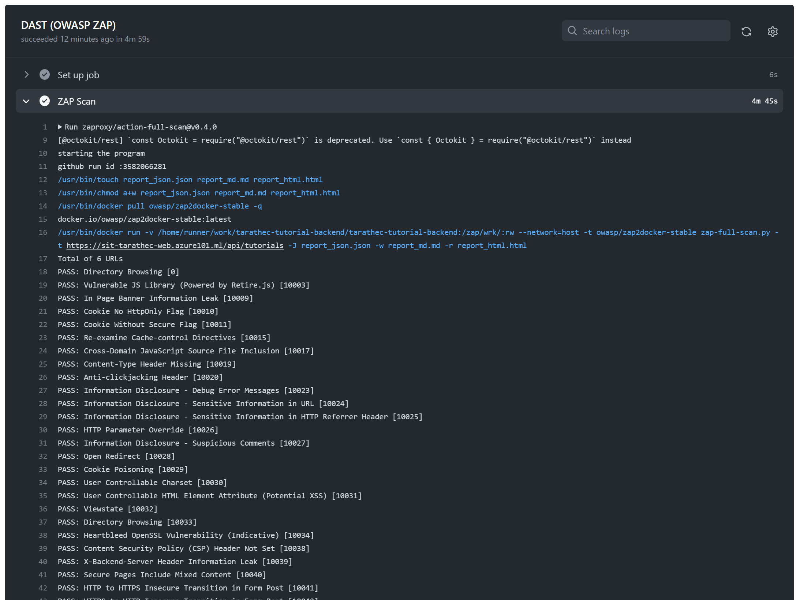</div>

Done :D


