# LAB 4 : End-to-End CI/CD Automate workflows

<div align="center">
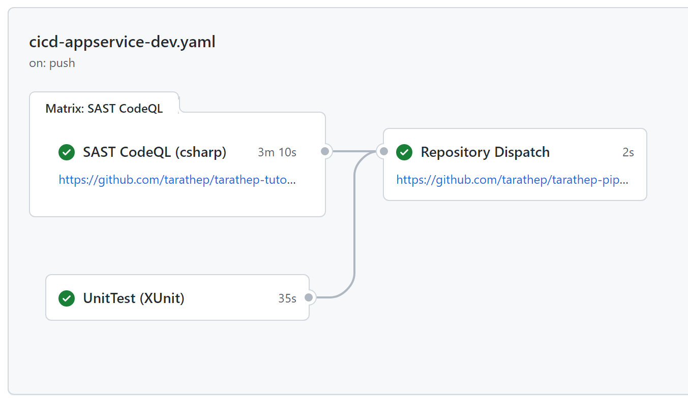
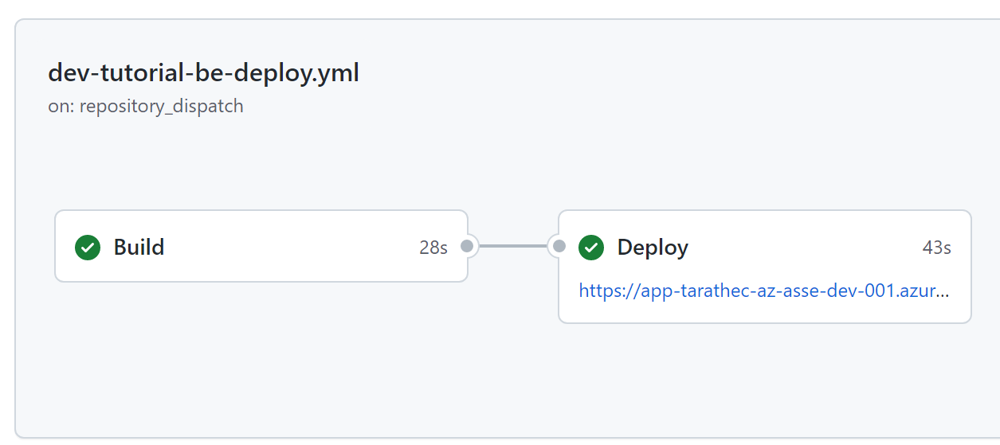
</div>

Learn how to continuous integration and deployment end-to-end process.


After completing this lab, you'll be able to:

- Understand the Continuous Integration and Deployment/Delivery flows.
- SDLC (Software development life cycle) Model to start when commit git to deployment.
- Investigate Workflows when action working.

## Prerequisites

- <b>Required Lab Implement CI must be completed.</b>
- <b>Required Lab Implement CD must be completed.</b>
- <b>Workspace that required Software and Tools</b> 
    - Git and GitHub Account
    - Text Editor (Required Visual Studio Code, or Visual Studio) [Visual Studio Code - Code Editing. Redefined](https://code.visualstudio.com/)
- <b>Infrastructures or Resources on Azure</b>
    - Azure App service (Webapp support deploy code and dotnet6) 
    - Azure App service plan (Windows or Linux)
    - Azure Cosmos DB for MongoDB API (Step for Initialize cosmos DB)
    - Azure Key Vault (if any)
    - Azure Application Insights (if any)


## Checking Resources Ready

On the Azure Spoke checking list below
- `app-<username>-az-<region>-dev-001`
- `app-<username>-az-<region>-sit-001`
- `id-<username>SelfHost-az-<region>-sbx-001`
- `mongo-<username>-az-<region>-sbx-001`
- `vm-<username>SelfHost-az-<region>-sbx-001`

<div align="center">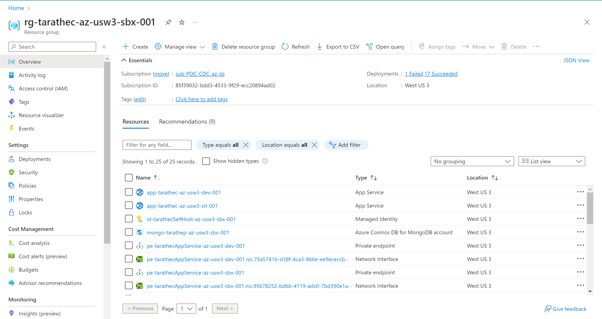</div>

GitHub’s repositories, CI and CD Open It.

 On CI repository at `https://github.com/<username>/<username>-tutorial-backend`

<div align="center">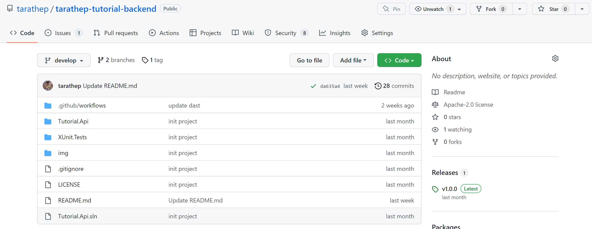</div>

On CD repository at `https://github.com/<username>/<username>-pipeline`

<div align="center">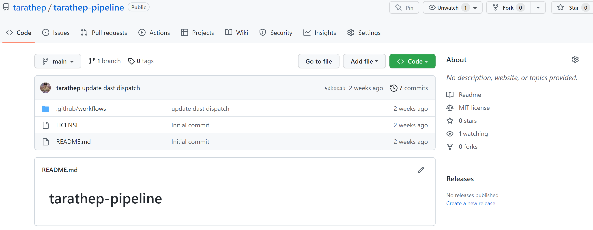</div>

## End-to-End on Environment Develop
 
Go to the Webapp on Azure access index page at `https://app-<username>-az-<region>-dev-001.azurewebsites.net`

you can see index page

<div align="center">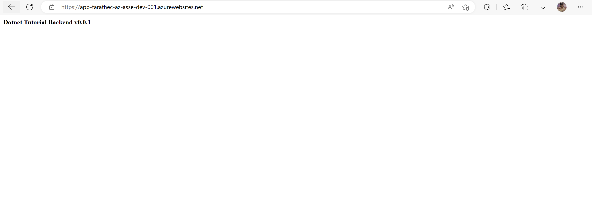</div>

Try to edit code with text editor 

On CI repository and Open Visual Studio Code or push  `.` on keyboard to open the Visual Studio Code on GitHub.

<div align="center">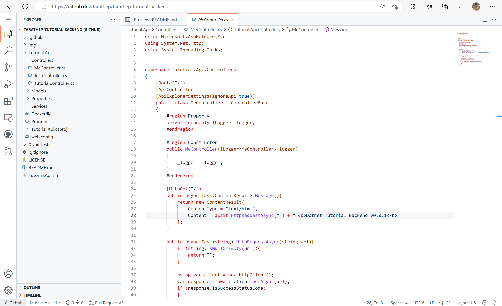</div>

On left side Inside `Tutorial.Api/Controllers/ `focus file named `MeController.cs`

on line 28 at method `HttpRequestAsnyc()` enter  below

```
HttpRequestAsync("https://raw.githubusercontent.com/<username>/username.github.io/main/index.html") + " <b>Dotnet Tutorial Backend v1.0.1</b>"
```

```c#
        [HttpGet("/")]
        public async Task<ContentResult> Message(){
            return new ContentResult{
                ContentType = "text/html",
                Content = await HttpRequestAsync("https://raw.githubusercontent.com/tarathep/tarathep.github.io/main/index.html") + " <b>Dotnet Tutorial Backend v0.0.2</b>"
            };
        }   
```

<b>Commit</b> at branch <b>develop</b>, and then see output at `Dev - Dispatch`

At Actions tab, you can see workflows running here.

Waiting for <5 min to executing workflows.

<b>CI - DEV</b>

<div align="center"></div>

when job have done in CI - Dev will continue dispatch to CD deployment to Webapp on Dev environment.

<b>CD - DEV</b>

<div align="center"></div>

If all workflows have done and success no error, you will see the output by index page will be changed.

<div align="center">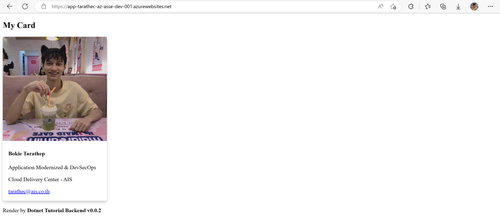</div>


---

## End-to-End on Environment SIT
 
Go to the Webapp on Azure access index page at `https://app-<username>-az-<region>-sit-001.azurewebsites.net`

try to deploy this version  v1.0.1 to sit

First, step merge source code from `develop` branch to `main` branch

go to the pull requests tab and then click New `pull request` on the green button.

<div align="center">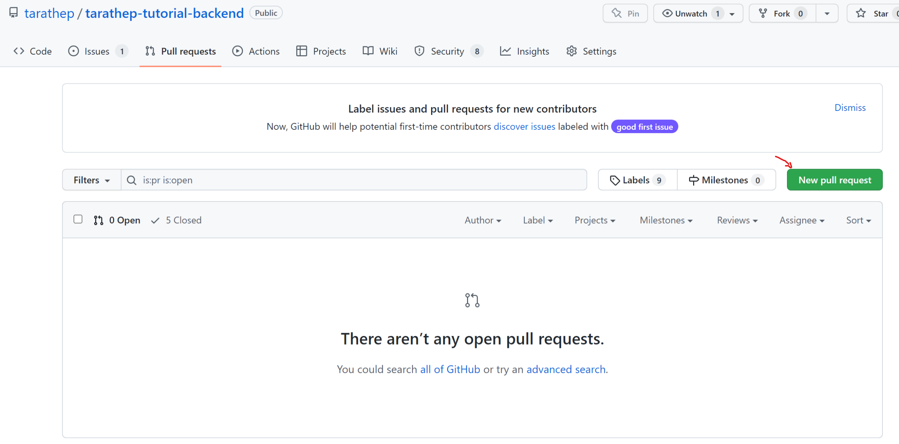</div>

Select branch from `base : main` to `compare : develop`, and then click `Create pull request`. 

<div align="center">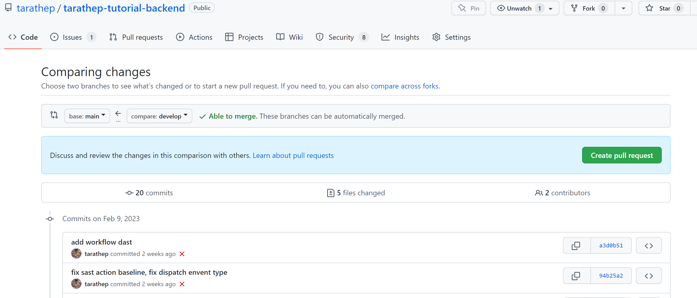</div>


Create pull request

<div align="center">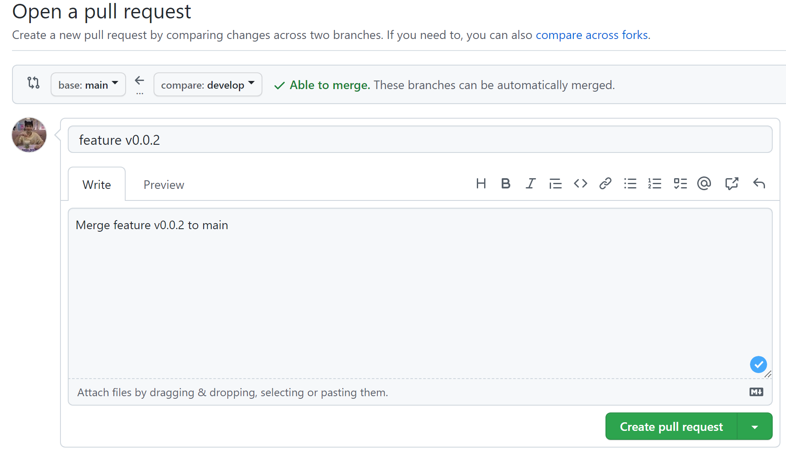</div>

Approved and confirm, merge it.

<div align="center">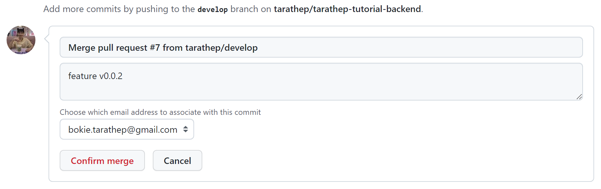</div>

Go back to code page and go to tag

<div align="center">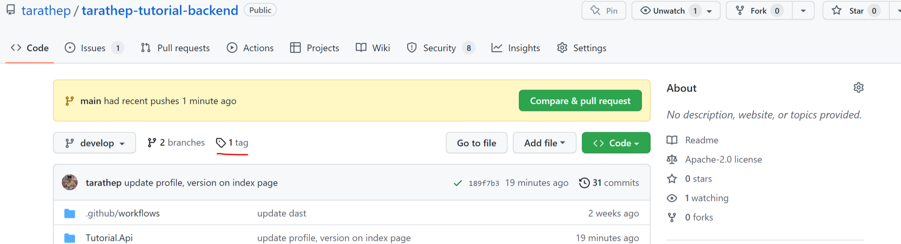</div>

create new release and tag (Draft a new release)

<div align="center">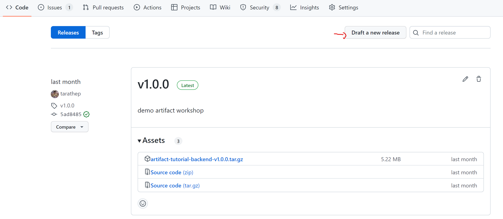</div>

Choose a tag : v1.0.1

<div align="center">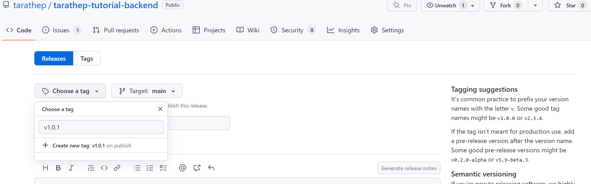</div>

waiting for workflow, sit on running

<div align="center">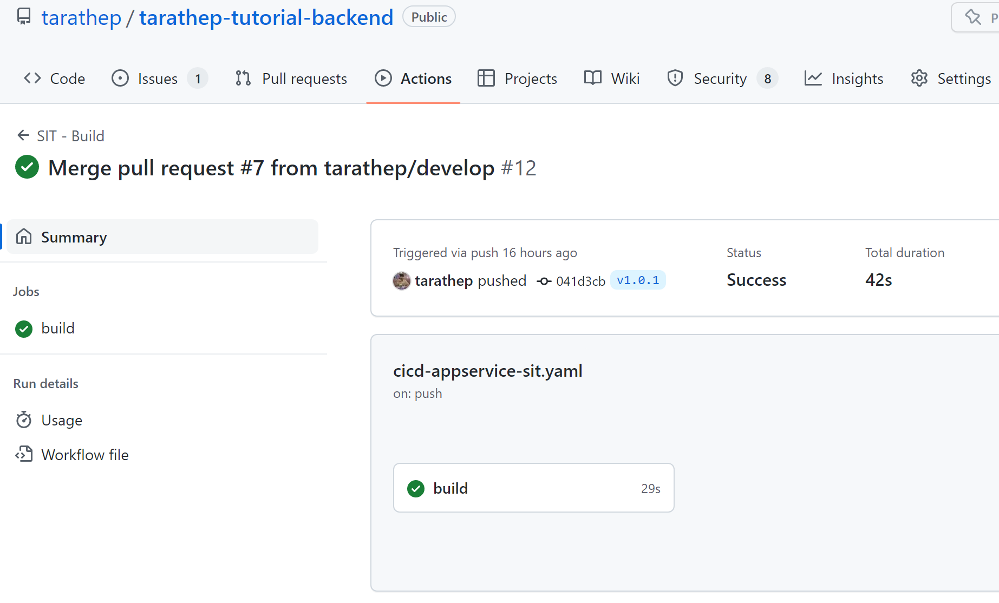</div>

Go back to the Tag page, you can see the artifact when workflow SIT build run have done.

Artifact name : `artifact-tutorial-backend-{version}.tag.gz`

<div align="center">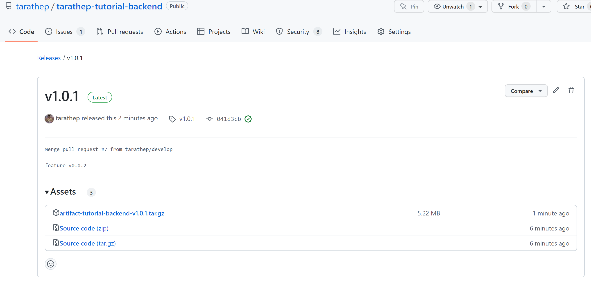</div>

For deploy, Go to the CD repository `<username>/<username>-pipeline` focusing on workflow named `SIT - Tutorial BE Deploy` and enter version v1.0.1 to deploy to SIT.

<div align="center">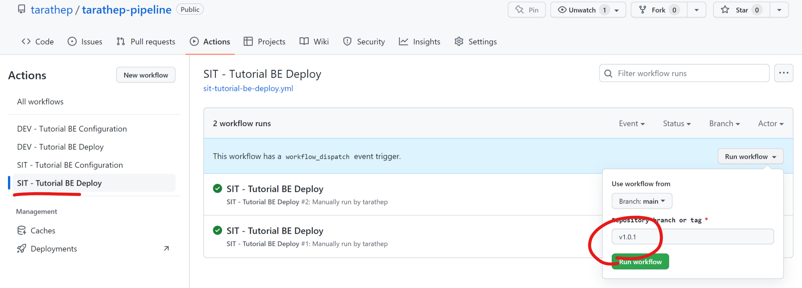</div>

<div align="center"></div>

<div align="center">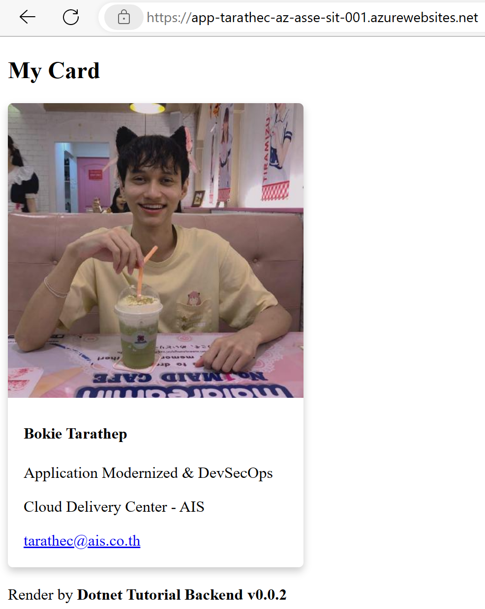</div>

Done :D


