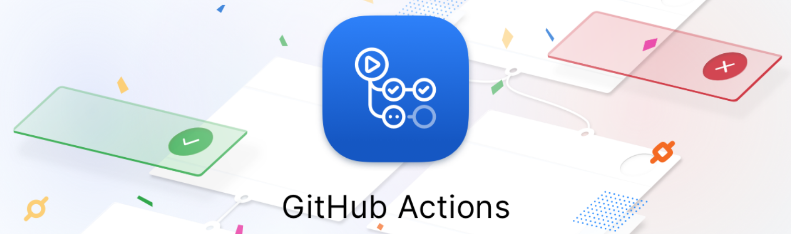
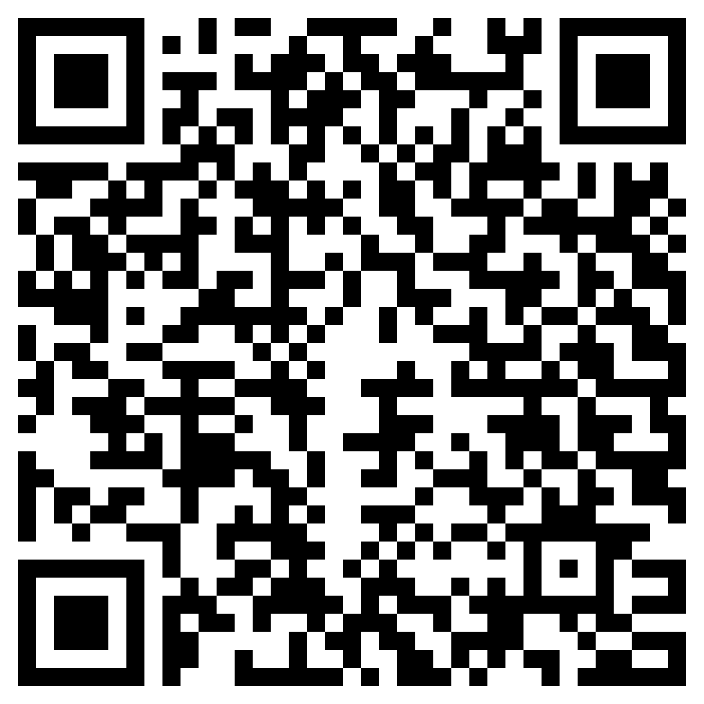

# Course DevSecOps CI/CD with GitHub Actions

## DAY 1 | Introduction and Preparation

- What is DevSecOps?
- DevSecOps Flow & Technology
- CI/CD workflows common in organization
- Microsoft Azure cloud introduction
- Learning path to be DevSecOps
- Version Control System
- Walkthrough / Workshop
    - [LAB 1: GitHub account and On-Boarding](./DayI/lab1.md)
    - [LAB 2: Basic GitHub and CLI Command](./DayI/lab2.md)
    - [LAB 3: My Card on GitHub with GitHub Page site](./DayI/lab3.md)

## DAY 2 | CI (Continuous Integration)

- Introduction & GitHub Actions
- Unit test
- Security: SAST
- Build Artifact & Build Image
- Walkthrough / Workshop
    - [LAB 1: Initialization Application](./DayII/lab1.md)
    - [LAB 2: Migrate Application to your Git Repository](./DayII/lab2.md)
    - [LAB 3: Build Artifact and Deploy to Azure App Service (Web App)](./DayII/lab3.md)
    - [LAB 4: Containerization with Docker](./DayII/lab4.md)
    - [LAB 5: Continuous Integration with GitHub Actions](./DayII/lab5.md)

## DAY 3 | CD (Continuous Deployment/Delivery)

- Deployment
- Business Test
- Load Test (Performance)
- Security: DAST
- Walkthrough / Workshop
    - [LAB 1: Create CD Repository pipeline on GitHub.](./DayIII/lab1.md)
    - [LAB 2: Implement workflows deploy to App service on DEV Environment](./DayIII/lab2.md)
    - [LAB 3: Implement workflows deploy to App service SIT Environment](./DayIII/lab3.md)
    - [LAB 4: End to End CI/CD Automation flows.](./DayIII/lab4.md)
- Applications Development (Optional)
- Operations & Monitoring tool (Optional)

<h3>Slide Here</h3>
 
<a href="https://docs.google.com/presentation/d/1w8ye1A74zOobaajLnbIIo6wXPiSZhoFXuTUQbptFxFc/edit?usp=sharing">Link</a>

